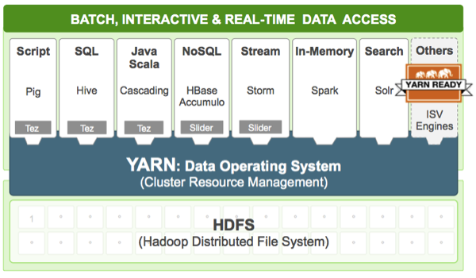

### YARN

#### 核心
ResourceManger    资源管理
ApplicationMaster 任务调度监控

YARN扩展Hadoop,不仅支持MapReduce计算,还能很方便的管理诸如Hive、Hbase、Pig、Spark/Shark等应用
种新的架构设计能够使得各种类型的应用运行在Hadoop上面，并通过Yarn从系统层面进行统一的管理，也就是说，有了Yarn，各种应用就可以互不干扰的运行在同一个Hadoop系统中，共享整个集群资源，如下图所示： 

#### 架构
1 RM(ResourceManager) + N NM(NodeManager)

ResourceManager的职责： 一个集群active状态的RM只有一个，负责整个集群的资源管理和调度
1）处理客户端的请求(启动/杀死)
2）启动/监控ApplicationMaster(一个作业对应一个AM)
3）监控NM
4）系统的资源分配和调度

NodeManager：整个集群中有N个，负责单个节点的资源管理和使用以及task的运行情况
1）定期向RM汇报本节点的资源使用请求和各个Container的运行状态
2）接收并处理RM的container启停的各种命令
3）单个节点的资源管理和任务管理

ApplicationMaster：每个应用/作业对应一个，负责应用程序的管理
1）数据切分
2）为应用程序向RM申请资源(container)，并分配给内部任务
3）与NM通信以启停task， task是运行在container中的
4）task的监控和容错

Container：
对任务运行情况的描述：cpu、memory、环境变量

####YARN执行流程
1) 用户向YARN提交作业
2) RM为该作业分配第一个container(AM)
3) RM会与对应的NM通信，要求NM在这个container上启动应用程序的AM
4) AM首先向RM注册，然后AM将为各个任务申请资源，并监控运行情况
5) AM采用轮训的方式通过RPC协议向RM申请和领取资源
6) AM申请到资源以后，便和相应的NM通信，要求NM启动任务
7) NM启动我们作业对应的task
8) 作业完成,AM想RM取消注册然后关闭,将所有的Container归还给系统

####YARN环境搭建
mapred-site.xml
	<property>
        <name>mapreduce.framework.name</name>
        <value>yarn</value>
    </property>

yarn-site.xml
	<property>
        <name>yarn.nodemanager.aux-services</name>
        <value>mapreduce_shuffle</value>
    </property>

启动yarn：sbin/start-yarn.sh

验证是否启动成功
	jps
		ResourceManager
		NodeManager
    web: http://hadoop001:8088

停止yarn： sbin/stop-yarn.sh

####mr提交作业
提交mr作业到yarn上运行： wc

/home/hadoop/app/hadoop-2.6.0-cdh5.7.0/share/hadoop/mapreduce/hadoop-mapreduce-examples-2.6.0-cdh5.7.0.jar

hadoop jar /home/hadoop/app/hadoop-2.6.0-cdh5.7.0/share/hadoop/mapreduce/hadoop-mapreduce-examples-2.6.0-cdh5.7.0.jar wordcount /input/wc/hello.txt /output/wc/

当我们再次执行该作业时，会报错：
FileAlreadyExistsException: 
Output directory hdfs://hadoop001:8020/output/wc already exists