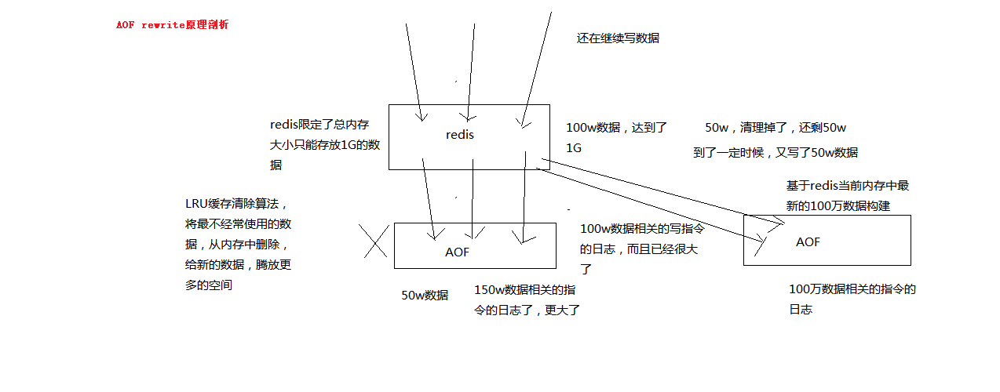
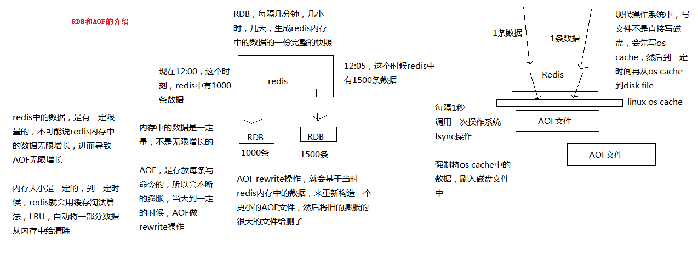

# redis

## Override

[一文读懂 Redis 基础、高级特性与性能调优](https://mp.weixin.qq.com/s/JLlMkCLxTQA4GU9j9g5Xew)

[同程凤凰缓存系统基于Redis的设计与实践](https://mp.weixin.qq.com/s/2FEbkas_m1WnYUqjVpMkWw)

[Redis 开发设计规范及案例分享](https://mp.weixin.qq.com/s/NICQmkAoe7jEo6vAEZJQRQ)

[史上最全 50 道 Redis 面试题](https://mp.weixin.qq.com/s/gB7oMjygGFF5M7WwTgrn4g)

[Redis5：抛弃ruby基于redis-cli创建集群&集群模式的得与失](https://mp.weixin.qq.com/s/csQE3RV17uZsAXwS4mI1Tw)

[数据库排名](https://db-engines.com/en/ranking)

[window的redis](https://github.com/microsoftarchive/redis/releases)


中华石衫分布式缓存面试

- [在项目中缓存是如何使用的？缓存如果使用不当会造成什么后果？](https://github.com/shishan100/Java-Interview-Advanced/blob/master/docs/high-concurrency/why-cache.md)
- [Redis 和 Memcached 有什么区别？Redis 的线程模型是什么？为什么单线程的 Redis 比多线程的 Memcached 效率要高得多？](https://github.com/shishan100/Java-Interview-Advanced/blob/master/docs/high-concurrency/redis-single-thread-model.md)
- [Redis 都有哪些数据类型？分别在哪些场景下使用比较合适？](https://github.com/shishan100/Java-Interview-Advanced/blob/master/docs/high-concurrency/redis-data-types.md)
- [Redis 的过期策略都有哪些？手写一下 LRU 代码实现？](https://github.com/shishan100/Java-Interview-Advanced/blob/master/docs/high-concurrency/redis-expiration-policies-and-lru.md)
- [如何保证 Redis 高并发、高可用？Redis 的主从复制原理能介绍一下么？Redis 的哨兵原理能介绍一下么？](https://github.com/shishan100/Java-Interview-Advanced/blob/master/docs/high-concurrency/how-to-ensure-high-concurrency-and-high-availability-of-redis.md)
- [Redis 的持久化有哪几种方式？不同的持久化机制都有什么优缺点？持久化机制具体底层是如何实现的？](https://github.com/shishan100/Java-Interview-Advanced/blob/master/docs/high-concurrency/redis-persistence.md)
- [Redis 集群模式的工作原理能说一下么？在集群模式下，Redis 的 key 是如何寻址的？分布式寻址都有哪些算法？了解一致性 hash 算法吗？如何动态增加和删除一个节点？](https://github.com/shishan100/Java-Interview-Advanced/blob/master/docs/high-concurrency/redis-cluster.md)
- [了解什么是 redis 的雪崩、穿透和击穿？Redis 崩溃之后会怎么样？系统该如何应对这种情况？如何处理 Redis 的穿透？](https://github.com/shishan100/Java-Interview-Advanced/blob/master/docs/high-concurrency/redis-caching-avalanche-and-caching-penetration.md)
- [如何保证缓存与数据库的双写一致性？](https://github.com/shishan100/Java-Interview-Advanced/blob/master/docs/high-concurrency/redis-consistence.md)
- [Redis 的并发竞争问题是什么？如何解决这个问题？了解 Redis 事务的 CAS 方案吗？](https://github.com/shishan100/Java-Interview-Advanced/blob/master/docs/high-concurrency/redis-cas.md)
- [生产环境中的 Redis 是怎么部署的？](https://github.com/shishan100/Java-Interview-Advanced/blob/master/docs/high-concurrency/redis-production-environment.md)

## 大纲
* 当下的NoSQL经典应用
* Redis入门介绍
* Redis数据类型
* 解析配置文件 redis.conf
* redis的持久化
* Redis的事务
* Redis的复制(Master/Slave)
* Redis的Java客户端Jedis

## 1、NoSQL分类与概况

- [当下的NoSQL经典应用学习](https://blog.csdn.net/andy2019/article/details/71775207)

- [NoSQL经典详解](https://www.cnblogs.com/12yang-ting/p/7494122.html)


| 类型   |      主要产品      |  简介 |
|----------|:-------------:|------:|
| KV存储 |  Redis、Memcached | 使用key快速查到其value,Memcached支持string类型的value,Redis除string类型外还支持set、hash、sort set、list等类型 |
| 文档存储 | MongoDB、Cassandra   |   使用JSON或类JSON的BSON数据结构，存储内容为文档型，能实现部分关系数据库的功能 |
| 列存储 | HBase、Cassandra |   按照列进行存储，便于存储结构化和半结构化数据，方便做数据压缩和针对某一列或几列的数据查询 |
| 图存储 | Neo4j、FlockDB |    图形关系的存储，能够很好弥补关系数据库在图形存储的不足 |
| 对象存储 | Db4o、Versant |    通过类似面向对象语言的方式操作数据库;通过对象方式存储数据 |
| XML数据库 | Berkeley DB XML、BaseX |    高效存储XML数据，支持XML内部查询语法，如XQuery、XPath |

### 看看阿里巴巴中文网站首页
以女装/女包包为例

#### 1 商品基本信息
```
名称、价格，出厂日期，生产厂商等

关系型数据库：mysql/oracle目前淘宝在去O化(也即拿掉Oracle)，

注意，淘宝内部用的Mysql是里面的大牛自己改造过的
```
#### 2 商品描述、详情、评价信息(多文字类)
```
多文字信息描述类，IO读写性能变差

文档数据库MongDB中
```

#### 3 商品的图片
```
分布式的文件系统中

商品图片展现类

分布式的文件系统中 1.淘宝自己的TFS->FastDFS 2.Google的GFS 3.Hadoop的HDFS
```

#### 4 商品的关键字
```
搜索引擎，淘宝内用

ISearch
```

#### 5 商品的波段性的热点高频信息
```
内存数据库

tair、Redis、Memcache
```

#### 6 商品的交易、价格计算、积分累计
```
外部系统，外部第3方支付接口

支付宝
```

### 在分布式数据库中CAP原理CAP+BASE

传统的ACID: A (Atomicity) 原子性、C (Consistency) 一致性、I (Isolation) 独立性、D (Durability) 持久性

CAP: C:Consistency（强一致性）、A:Availability（可用性）、P:Partition tolerance（分区容错性）

## 2、Redis入门介绍

### redis的目录结构
redis-benchmark:性能测试工具
redis-check-aof：修复有问题的AOF文件
redis-check-dump：修复有问题的dump.rdb文件
redis-cli：客户端，操作入口
redis-sentinel：redis集群使用
redis-server：Redis服务器启动命令

## 3、Redis数据类型

list、set、sorted set、hash、string

incr 递增

## 4、redis架构

### 单点

### 主从复制(Replication)
一个Redis服务可以有多个该服务的复制品，这个Redis服务称为Master，其他复制品称为Slaves

只要网络连接正常，Master会一直将自己的数据更新同步给Slaves，保持主从同步

只有Master可以执行写命令，Slaves只能执行读命令

从服务器执行客户端发送的读命令，比如GET、LRANGE、SMEMMBERS、HGET、ZRANGE等等

客户端可以连接Slaves执行读请求，来降低Master的读压力

好处: 1、读写分离 2、容灾恢复

创建从节点:
    redis-server --slaveof <master-ip> <master-port>
    redis-server --port 6380 --slaveof 127.0.0.1 6379

### 哨兵(Sentinel)
用于监控redis集群中Master主服务器工作的状态，在Master主服务器发生故障的时候，可以实现Master和Slave服务器的切换，保证系统的高可用

### 集群(twemproxy)
* 3.0支持
* 由多个Redis服务器组成的分布式网络服务集群
* 每一个Redis服务器称为节点Node，节点之间会互相通信。两两相连

官方推荐
去中心化，集群最大可增加1000个节点，性能随节点增加而线性扩展。
管理方便，后续可自行增加或摘除节点，移动分槽等等。
简单，易上手

### 集群(直连)

|   方式   |      twemproxy      |  集群 |
|----------|:-------------:|------:|
| 运作模式 |  代理模式，代理本身可能成为性能瓶颈，随着负载的增加需要添加更多twemproxy来分担请求负载，但每个twemproxy本身也会消耗一定的资源| 代理模式，代理本身可能成为性能瓶颈，随着负载的增加需要添加更多twemproxy来分担请求负载，但每个twemproxy本身也会消耗一定的资源 |
| 分片     |   基本上是按照池中的服务器数量N来分片，每个服务器平均占整个数据库的1/N   |  按照槽来进行分片，通过每个节点指派不同数量的槽，可以控制不同节点负责数据量和请求数量 |
| 复制和高可用 | 需要配合Redis的复制特性以及Redis Sentinel才能实现复制和高可用 |   集群的节点内置了复制和高可用特性 |

## 5、redis事务


## 6、持久化
### 6.1 模式

* RDB(redis DB) 类似于HDFS:fsimage
  默认
  在指定的时间间隔内，执行指定次数的写操作，则会将内存中的数据写入到磁盘中。
  即在指定目录下生成一个dump.rdb文件。Redis 重启会通过加载dump.rdb文件恢复数据

```properties
#Redis4.0新增RDB-AOF混合持久化格式，在开启了这个功能之后，AOF重写产生的文件将同时包含RDB格式的内容和AOF格式的内容，其中RDB格式的内容用于记录已有的数据，而AOF格式的内存则用于记录最近发生了变化的数据，这样Redis就可以同时兼有RDB持久化和AOF持久化的优点（既能够快速地生成重写文件，也能够在出现问题时，快速地载入数据）。
aof-use-rdb-preamble no
# 开启rdb文件压缩,耗费CPU资源,默认开启
rdbcompression yes
# 对rdb数据进行校验，耗费CPU资源，默认为yes
rdbchecksum yes
```

* AOF(AppendOnlyFile): 类似于 hdfs:edit logs  关闭的

```properties
# 开启aof,默认不开启
appendonly yes

# 3种刷写模式
# 1. 每次收到命令就立即强制写入磁盘,是在最有保证的完全持久化,但速度也是最慢的，一般不推荐使用
# appendfsync always

# 2. 每秒钟强制写入磁盘一次,在性能和持久化方面做了很好的折中,是最受推荐的方式
appendfsync everysec

# 3. 完全依赖os的写入,一般为30秒左右一次,性能最好但是持久化没有保证,不被推荐
# appendfsync no
```

[AOF、RDB和复制功能对过期键的处理](https://www.cnblogs.com/lukexwang/p/4710333.html)
```
PEXPIREAT
$6
string
$13
1557675381807 ==> 2019-05-12 23:36:21

过期键策略: 记录过期时间的毫秒时间戳
```

### 6.2 持久化机制对于故障恢复的意义

持久化的意义 故障恢复

如果没有持久化的话，redis遇到灾难性故障的时候，就会丢失所有的数据

如果通过持久化将数据搞一份儿在磁盘上去，然后定期比如说同步和备份到一些云存储服务上去，那么就可以保证数据不丢失全部，还是可以恢复一部分数据回来的

### 6.3 RDB和AOF

1、RDB和AOF两种持久化机制的介绍
2、RDB持久化机制的优点
3、RDB持久化机制的缺点
4、AOF持久化机制的优点
5、AOF持久化机制的缺点
6、RDB和AOF到底该如何选择

对于一个企业级的redis架构来说，持久化是不可减少的

企业级redis集群架构：海量数据、高并发、高可用

持久化主要是做灾难恢复，数据恢复，也可以归类到高可用的一个环节里面去

比如你redis整个挂了，然后redis就不可用了，你要做的事情是让redis变得可用，尽快变得可用

重启redis，尽快让它对外提供服务，如果没做数据备份，这个时候redis启动了，也不可用啊，数据都没了

很可能说，大量的请求过来，缓存全部无法命中，在redis里根本找不到数据，这个时候就死定了，缓存雪崩问题，所有请求，没有在redis命中，就会去mysql数据库这种数据源头中去找，一下子mysql承接高并发，然后就挂了

mysql挂掉，你都没法去找数据恢复到redis里面去，redis的数据从哪儿来？从mysql来。。。

如果把redis的持久化做好，备份和恢复方案做到企业级的程度，那么即使你的redis故障了，也可以通过备份数据，快速恢复，一旦恢复立即对外提供服务

redis的持久化，跟高可用，是有关系的

redis持久化：RDB，AOF




-------------------------------------------------------------------------------------

1、RDB和AOF两种持久化机制的介绍

RDB持久化机制，对redis中的数据执行周期性的持久化

AOF机制对每条写入命令作为日志，以append-only的模式写入一个日志文件中，在redis重启的时候，可以通过回放AOF日志中的写入指令来重新构建整个数据集

如果我们想要redis仅仅作为纯内存的缓存来用，那么可以禁止RDB和AOF所有的持久化机制

通过RDB或AOF，都可以将redis内存中的数据给持久化到磁盘上面来，然后可以将这些数据备份到别的地方去，比如说阿里云，云服务

如果redis挂了，服务器上的内存和磁盘上的数据都丢了，可以从云服务上拷贝回来之前的数据，放到指定的目录中，然后重新启动redis，redis就会自动根据持久化数据文件中的数据，去恢复内存中的数据，继续对外提供服务

如果同时使用RDB和AOF两种持久化机制，那么在redis重启的时候，会使用AOF来重新构建数据，因为AOF中的数据更加完整

-------------------------------------------------------------------------------------

2、RDB持久化机制的优点

（1）RDB会生成多个数据文件，每个数据文件都代表了某一个时刻中redis的数据，这种多个数据文件的方式，非常适合做冷备，可以将这种完整的数据文件发送到一些远程的安全存储上去，比如说Amazon的S3云服务上去，在国内可以是阿里云的ODPS分布式存储上，以预定好的备份策略来定期备份redis中的数据

（2）RDB对redis对外提供的读写服务，影响非常小，可以让redis保持高性能，因为redis主进程只需要fork一个子进程，让子进程执行磁盘IO操作来进行RDB持久化即可

（3）相对于AOF持久化机制来说，直接基于RDB数据文件来重启和恢复redis进程，更加快速

-------------------------------------------------------------------------------------

3、RDB持久化机制的缺点

（1）如果想要在redis故障时，尽可能少的丢失数据，那么RDB没有AOF好。一般来说，RDB数据快照文件，都是每隔5分钟，或者更长时间生成一次，这个时候就得接受一旦redis进程宕机，那么会丢失最近5分钟的数据

（2）RDB每次在fork子进程来执行RDB快照数据文件生成的时候，如果数据文件特别大，可能会导致对客户端提供的服务暂停数毫秒，或者甚至数秒

-------------------------------------------------------------------------------------

4、AOF持久化机制的优点

（1）AOF可以更好的保护数据不丢失，一般AOF会每隔1秒，通过一个后台线程执行一次fsync操作，最多丢失1秒钟的数据

（2）AOF日志文件以append-only模式写入，所以没有任何磁盘寻址的开销，写入性能非常高，而且文件不容易破损，即使文件尾部破损，也很容易修复

（3）AOF日志文件即使过大的时候，出现后台重写操作，也不会影响客户端的读写。因为在rewrite log的时候，会对其中的指导进行压缩，创建出一份需要恢复数据的最小日志出来。再创建新日志文件的时候，老的日志文件还是照常写入。当新的merge后的日志文件ready的时候，再交换新老日志文件即可。

（4）AOF日志文件的命令通过非常可读的方式进行记录，这个特性非常适合做灾难性的误删除的紧急恢复。比如某人不小心用flushall命令清空了所有数据，只要这个时候后台rewrite还没有发生，那么就可以立即拷贝AOF文件，将最后一条flushall命令给删了，然后再将该AOF文件放回去，就可以通过恢复机制，自动恢复所有数据

-------------------------------------------------------------------------------------

5、AOF持久化机制的缺点

（1）对于同一份数据来说，AOF日志文件通常比RDB数据快照文件更大

（2）AOF开启后，支持的写QPS会比RDB支持的写QPS低，因为AOF一般会配置成每秒fsync一次日志文件，当然，每秒一次fsync，性能也还是很高的

（3）以前AOF发生过bug，就是通过AOF记录的日志，进行数据恢复的时候，没有恢复一模一样的数据出来。所以说，类似AOF这种较为复杂的基于命令日志/merge/回放的方式，比基于RDB每次持久化一份完整的数据快照文件的方式，更加脆弱一些，容易有bug。不过AOF就是为了避免rewrite过程导致的bug，因此每次rewrite并不是基于旧的指令日志进行merge的，而是基于当时内存中的数据进行指令的重新构建，这样健壮性会好很多。

-------------------------------------------------------------------------------------

6、RDB和AOF到底该如何选择

（1）不要仅仅使用RDB，因为那样会导致你丢失很多数据

（2）也不要仅仅使用AOF，因为那样有两个问题，第一，你通过AOF做冷备，没有RDB做冷备，来的恢复速度更快; 第二，RDB每次简单粗暴生成数据快照，更加健壮，可以避免AOF这种复杂的备份和恢复机制的bug

（3）**综合使用AOF和RDB两种持久化机制，用AOF来保证数据不丢失，作为数据恢复的第一选择; 用RDB来做不同程度的冷备，在AOF文件都丢失或损坏不可用的时候，还可以使用RDB来进行快速的数据恢复**

## 7、Scan

### 7.1 前言

有时候我们需要知道线上的redis的使用情况，尤其需要知道一些前缀的key值，那我们怎么去查看呢？
事故产生

因为我们的用户token缓存是采用了【user_token:userid】格式的key，保存用户的token的值。

我们运维为了帮助开发小伙伴们查一下线上现在有多少登录用户，直接用了keys user_token*方式进行查询。

事故就此发生了。导致redis不可用，假死。

### 7.2 分析原因

我们线上的登录用户有几百万，数据量比较多；keys算法是遍历算法，复杂度是O(n)，也就是数据越多，时间复杂度越高。

数据量达到几百万，keys这个指令就会导致 Redis 服务卡顿

因为 Redis 是单线程程序，顺序执行所有指令，其它指令必须等到当前的 keys 指令执行完了才可以继续。

### 7.3 解决方案

那我们如何去遍历大数据量呢？

这个也是面试经常问的。我们可以采用redis的另一个命令scan。我们看一下scan的特点

1、复杂度虽然也是 O(n)，但是它是通过游标分步进行的，不会阻塞线程
2、提供 count 参数，不是结果数量，是redis单次遍历字典槽位数量(约等于)
3、同 keys 一样，它也提供模式匹配功能;
4、服务器不需要为游标保存状态，游标的唯一状态就是 scan 返回给客户端的游标整数;
5、返回的结果可能会有重复，需要客户端去重复，这点非常重要;
6、单次返回的结果是空的并不意味着遍历结束，而要看返回的游标值是否为零

一、scan命令格式

> SCAN cursor [MATCH pattern] [COUNT count]

二、命令解释：scan 游标 MATCH <返回和给定模式相匹配的元素> count 每次迭代所返回的元素数量

SCAN命令是增量的循环，每次调用只会返回一小部分的元素。所以不会让redis假死
SCAN命令返回的是一个游标，从0开始遍历，到0结束遍历

三、举例
```
redis > scan 0 match user_token* count 5
 1) "6"
 2) 1) "user_token:1000"
 2) "user_token:1001"
 3) "user_token:1010"
 4) "user_token:2300"
 5) "user_token:1389"
```
从0开始遍历，返回了游标6，又返回了数据，继续scan遍历，就要从6开始

```
redis > scan 6 match user_token* count 5
 1) "10"
 2) 1) "user_token:3100"
 2) "user_token:1201"
 3) "user_token:1410"
 4) "user_token:5300"
 5) "user_token:3389"
```

#### 7.4 总结

这个是面试经常会问到的，在工作的过程经常用的

一般小公司，不会有什么问题，但数据量多的时候...

#### LRU

[漫画：什么是LRU算法？](https://mp.weixin.qq.com/s/h_Ns5HY27NmL_odCYLgx_Q)


## 8 使用

### 延迟队列

延时队列就是一种带有延迟功能的消息队列。下面会介绍几种目前已有的延时队列：

1. Java中java.util.concurrent.DelayQueue
   优点：JDK自身实现，使用方便，量小适用
   缺点：队列消息处于jvm内存，不支持分布式运行和消息持久化

2. Rocketmq延时队列
   优点：消息持久化，分布式
   缺点：不支持任意时间精度，只支持特定level的延时消息

   Rabbitmq延时队列（TTL+DLX实现）

   https://blog.csdn.net/zhu_tianwei/article/details/53563311

   优点：消息持久化，分布式
   缺点：延时相同的消息必须扔在同一个队列

3. ### redis延迟队列

   https://blog.csdn.net/wizard_rp/article/details/79303623

   https://github.com/Yampery/rdsmq

   [基于Redis实现延时队列服务](https://www.cnblogs.com/lylife/p/7881950.html)

   [分布式之延时任务方案解析]( https://www.cnblogs.com/rjzheng/p/8972725.html)

根据自身业务和公司情况，如果实现一个自己的延时队列服务需要考虑一下几点:

* 消息存储
* 过期延时消息实时获取
* 高可用性

## 9 redis面试题

#### 9.1 在项目中缓存是如何使用的？缓存如果使用不当会造成什么后果？

场景:  

* 统计,kafka消费端去重 
* 短信验证码,统计次数
* 缓存用户信息


为什么使用?

* 高性能

* 高性能


使用不当后果

* 缓存和数据库不一致
* 缓存雪崩、缓存穿透
* 缓存并发竞争


####  9.2 如何保证缓存与数据库的双写一致性？ 

   缓存+数据库读写 **Cache Aside Pattern**

- 读的时候，先读缓存，缓存没有的话，就读数据库，然后取出数据后放入缓存，同时返回响应。

- 更新的时候，**先更新数据库，然后再删除缓存**

  

上亿流量高并发场景,解决方案

 更新数据的时候，根据**数据的唯一标识**，将操作路由之后，发送到一个 jvm 内部队列中。读取数据的时候，如果发现数据不在缓存中，那么将重新读取数据+更新缓存的操作，根据唯一标识路由之后，也发送同一个 jvm 内部队列中 


#### 9.3 缓存雪崩

大面积缓存失效或宕机,大量的查询直接到数据库


解决方案

- 事前：redis 高可用，主从+哨兵，redis cluster，避免全盘崩溃。

  ​           避免热点数据集中失效(过期时间打撒,基础时间加减一个范围内的随机值)

- 事中：本地 ehcache 缓存 + hystrix 限流&降级，避免 MySQL 被打死。

- 事后：redis 持久化，一旦重启，自动从磁盘上加载数据，快速恢复缓存数据。


#### 9.4 缓存穿透

 查询不存在数据 


问题:  

​	数据库由于压力过大而宕掉 

解决:

* 缓存空值, 设置过期时间

* #### BloomFilter

   在查询的时候先去 BloomFilter 去查询 key 是否存在，如果不存在就直接返回，存在再走查缓存 -> 查 DB 

选择:

​	 恶意攻击，攻击带过来的大量key 是不存在的 --BloomFilter 过滤key

​     空数据的key有限的，重复率比较高 --缓存空值