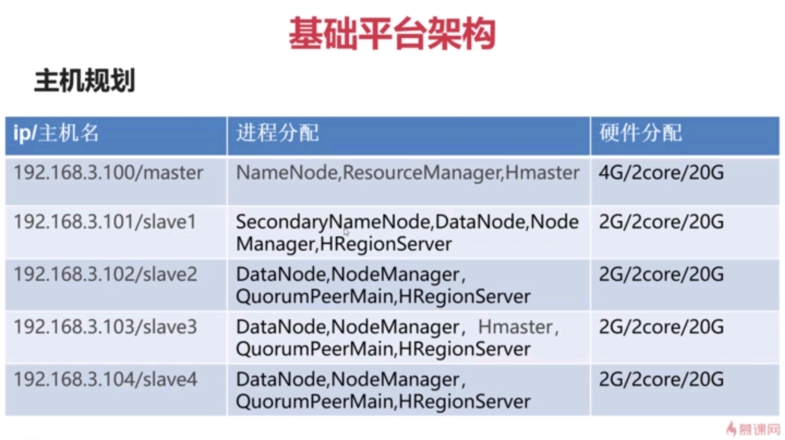
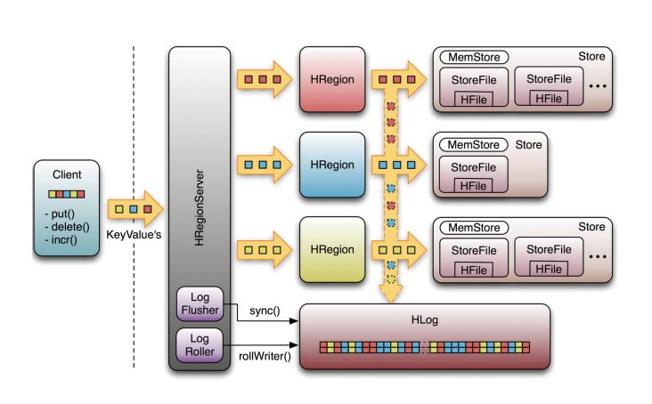
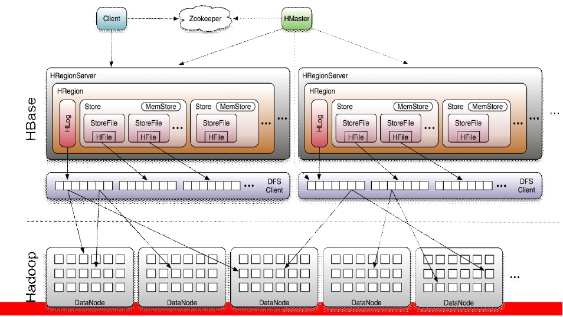

# Hbase

## Overview
[官网](http://hbase.apache.org/)
[下载](http://hbase.apache.org/downloads.html)
[学习时使用1.2.4版本,下载地址](http://archive.apache.org/dist/hbase/1.2.4/hbase-1.2.4-bin.tar.gz)

[HBase 默认配置](https://blog.csdn.net/u011414200/article/details/50427529)

## doc

[HBase Procedure解读](https://mp.weixin.qq.com/s/mpG5Gte-7g_Ue0Sr8VLS6w)

[58HBase平台实践和应用—平台建设篇](https://mp.weixin.qq.com/s/Czx-tDEdN11srmGuA-4Jkw)
多租户支持、数据读写接口、数据导入导出和平台优化四个方面重点讲解了58HBase平台的建设

[HBase实战 | 排查HBase堆外内存溢出](https://mp.weixin.qq.com/s/JDgtbulwfPgnjRbJ-zrfug)

[HBase2实战之HBase Flink和Kafka整合](https://mp.weixin.qq.com/s/1UgPtCmP2t3vSfVsRX_OWA)

[从MySQL到HBase：分库分表方案转型的演进](https://mp.weixin.qq.com/s/aPaty1t30TxrRHieS64OWw)

项目实战 Hbase+Spring boot实战分布式文件存储

[云HBase全文索引服务，增强HBase的检索能力](https://mp.weixin.qq.com/s/e6Zv8jVfzJfVKdHBlfyAFw)

[HBase迁移 | HBase金融大数据乾坤大挪移](https://mp.weixin.qq.com/s/NmJBrGz_rTxR-spRtWTC8A)

[HBase实战 | 不中断业务，腾讯10P+金融数据跨机房迁移实战](https://mp.weixin.qq.com/s/e7CRCaUVWU8mhuKeL7ge_w)

[都是 HBase 上的 SQL 引擎，Kylin 和 Phoenix 有什么不同？](https://mp.weixin.qq.com/s/CQ9nlO14Do0Q0_Y6QU9jBw)

[HBase 读流程解析与优化的最佳实践](https://mp.weixin.qq.com/s/cj-HJNfZ2O7kCAFNL4l7Eg)

[HBase基本概念与基本使用](https://www.cnblogs.com/swordfall/p/8737328.html)

[基于HBase构建千亿级文本数据相似度计算与快速去重系统](https://mp.weixin.qq.com/s/UZmksFBTKFzF4jrXGnw2fg)

[在 HBase 上使用 HGraphDB 进行二度好友推荐](https://mp.weixin.qq.com/s/AUn8qEaih9w--WbfxU46cQ)

[HBase的region管理](https://mp.weixin.qq.com/s/mg6c_h38efILWo_HAWy9zQ)

[HBase实践 | 使用Spark SQL读写HBase,Apache Spark-Apache HBase Connector](https://mp.weixin.qq.com/s/295XcqqylBxmhajLWZ1KSQ)

[HBase 原理 | 漫谈HBase Filter](https://mp.weixin.qq.com/s/c8L5Uu7IG_H6uGK2ytgd_A)

### 官方翻译文档

[官方文档中文版0.97](http://abloz.com/hbase/book.html)

[HBase原理和设计](https://www.toutiao.com/i6601011304679342596)

### 官方quick start翻译

http://hbase.apache.org/book.html#quickstart

https://www.cnblogs.com/LeslieXia/p/5743436.html

## 官方安装

[quick start](http://hbase.apache.org/book.html#quickstart)

[HBase完全分布式配置](https://m.imooc.com/article/details?article_id=27253)

[hbase使用外部（非自带）zookeeper搭建伪分布式环境](https://blog.csdn.net/xuedingkai/article/details/78816862)  


部署模式: 单机 伪分布式 完全分布式

[版本选择](http://hbase.apache.org/2.1/book.html#hadoop)

[Advanced - Fully Distributed](http://hbase.apache.org/2.1/book.html#quickstart_fully_distributed)
```
conf/regionservers
node2 node3

conf/backup-masters
node3

conf/hbase-site.xml
<property>
  <name>hbase.zookeeper.quorum</name>
  <value>node-a.example.com,node-b.example.com,node-c.example.com</value>
</property>
<property>
  <name>hbase.zookeeper.property.dataDir</name>
  <value>/usr/local/zookeeper</value>
</property>
<property>
  <name>hbase.cluster.distributed</name>
  <value>true</value>
</property>
```

## NoSQL

Cassandra hbase mongodb 
Couchdb，文件存储数据库
Neo4j非关系型图数据库

## 简介
Hadoop Database，是一个高可靠性、高性能、面向列、可伸缩、实时读写的分布式数据库

利用Hadoop HDFS作为其文件存储系统,利用Hadoop MapReduce来处理HBase中的海量数据,利用Zookeeper作为其分布式协同服务

主要用来存储非结构化和半结构化的松散数据（列存 NoSQL 数据库）

来源谷歌的三篇论文之big table

### 企业集群架构及版本选择

#### 企业集群
20- 小型集群
    无HA,1个zookeeper、hbase、hadoop
    hReginServer、NodeManager(如40G,得分配20G)

20-50 中型集群
    hadoopHA、hbaseHA、3个zookeeper、3个Hmaster

50+  大型集群    
   5/7个zookeeper

#### 集群规划



#### 版本选择:
    apache/cloudera(CDH)
    推荐cloudear的CDH版本
    
## 场景

### 使用场景
* 用户画像
* 消息/订单存储
* 对象存储
* 时序数据(随着时间变化而变化,例如温度)
* Cube分析(Kylin)
* Feeds流(内容聚合器,例如:抖音、西瓜视频)

* 如果数据有很多列，且包含很多空字段
* 数据包含了不定数量的列
* 需要维护数据的版本
* 需要很高的横向扩展性
* 需要大量的压缩数据
* 需要大量的I/O
一般而言数百万行的数据和频率不高的读写操作，是不需要HBase的，如果有几十亿列数据，同时在单位时间内有数以千、万记的读写操作，可以考虑HBase

### 不适用场景
* 数据总量不大时（比如就几个G）
* 当需要JOIN以及关系型数据库的一些特性时
* 如果关系型数据库可以满足需求

## 数据模型

row key:行键,相当于mysql主键
        最关键的是row key的设计
        决定一行数据
        按照字典顺序排序
        只能存储64k的字节数据

timestamep:时间戳,是版本号
            
CF:  列族,Hbase表中的每个列，都归属于某个列族。
     列族是表的schema的一部分(而列不是)，必须在使用表之前定义。
     列名都以列族作为前缀。例如courses：history，courses：math 都属于courses这个列族
     权限控制、存储以及调优都是在列族层面进行

cell:单元格,由行、列的坐标交叉决定
     实际保存数据
     单元格的内容是未解析的字节数组
     
Hlog(WAL log)
    记录操作和数据(可恢复数据)

## 配置
1. hbase-env.sh
```
# 配置Java环境
export JAVA_HOME=/usr/local/java
# fasle禁用自带的zookeeper
export HBASE_MANAGES_ZK=false
```
2. 拷贝ZOOKEEPER_HOME/conf/zoo.cfg到HBASE_HOME/conf/,官方推荐
或者修改 conf/hbase-site.xml

hbase-site.xml
```
<!-- hbase数据存放的目录，若用本地目录，必须带上file://,否则hbase启动不起来 --> 
 <property>
    <name>hbase.rootdir</name>
    <value>file:///usr/local/hbase/rootdir</value>
  </property>
  <property>
    <name>hbase.zookeeper.property.dataDir</name>
    <value>/usr/local/zookeeper/dataDir</value>
  </property>
  <!-- Zookeeper集群的地址列表 -->
  <property>
    <name>hbase.zookeeper.quorum</name>
    <value>localhost</value>
    <description>the pos of zk</description>
  </property>

  <property>
    <name>hbase.unsafe.stream.capability.enforce</name>
    <value>false</value>
    <description>
      Controls whether HBase will check for stream capabilities (hflush/hsync).

      Disable this if you intend to run on LocalFileSystem, denoted by a rootdir
      with the 'file://' scheme, but be mindful of the NOTE below.

      WARNING: Setting this to false blinds you to potential data loss and
      inconsistent system state in the event of process and/or node failures. If
      HBase is complaining of an inability to use hsync or hflush it's most
      likely not a false positive.
    </description>
  </property>
  
  <!-- 此处必须为true，不然hbase仍用自带的zk，若启动了外部的zookeeper，会导致冲突，hbase启动不起来 -->
  <!-- 开启集群运行方式 --> 
  <property>
     <name>hbase.cluster.distributed</name>
     <value>true</value>
  </property>

  <!-- hbase主节点的位置 -->
  <property>
    <name>hbase.master</name>
    <value>localhost:60000</value>
  </property>
```
3. 启动进程
/usr/local/hbase/bin/start-hbase.sh
 
4.浏览器访问
> http://localhost:16010/

hbase.regionserver.port
60020->16020

#### 启动遇到的问题
1. ERROR [main] master.HMasterCommandLine: Master exiting
   java.lang.NoClassDefFoundError: org/apache/htrace/SamplerBuilder
   解决办法:
   cp $HBASE_HOME/lib/client-facing-thirdparty/htrace-core-3.1.0-incubating.jar $HBASE_HOME/lib/    
2. File /hbase/.tmp/hbase.version could only be replicated to 0 nodes instead of minReplica
   问题定位:
   datanode没有启动
   可通过jps命令查看启动状态
   
   查看日志 logs/hadoop-root-datanode-hadoop001.log
   异常信息:
   java.io.IOException: Incompatible clusterIDs in /usr/local/hadoop/data/dfs/data: namenode clusterID = CID-3ee7da46-fc08-4fb5-810f-03ded0cdd9a7; datanode clusterID = CID-6ed4b66b-d177-42ec-8f68-efab7881b38a
   ERROR org.apache.hadoop.hdfs.server.datanode.DataNode: Initialization failed for Block pool <registering> (Datanode Uuid 1141965e-c710-402a-b176-cf0d27087a69) service to hadoop001/0.0.0.0:9000. Exiting. 
   java.io.IOException: All specified directories have failed to load.
   
   dfs.namenode.name.dir配置有误,应为file:///
3. org.apache.hadoop.hdfs.server.datanode.DataNode: Block pool ID needed, but service not yet registered with NN, trace   
4. org.apache.hadoop.hbase.NotServingRegionException: Region is not online 错误
    问题分析:regionserver 挂掉或者其他原因导致连接不上regionserver,原因:数据损坏大致当前数据存放的regin无法使用
    解决办法:关闭ZooKeeper，删除zookeeper的dataDir路径下的version-2文件夹，然后重启
5. java.lang.NoSuchMethodException: org.apache.hadoop.fs.LocalFileSystem.setStoragePolicy(org.apache.hadoop.fs.Path, java.lang.String)

6. ERROR: Can't get master address from ZooKeeper; znode data == null
运行hbase(zookeeper)的用户无法写入zookeeper文件，导致znode data为空
 <property>
    <name>hbase.zookeeper.property.dataDir</name>
    <value>/home/hadoop/app/tmp/zk</value>
  </property>
  
## hbase shell

### 开启
bin/hbase shell

### Create a table
create 'test', 'cf'

### List Information About your Table
list 'test'

### Now use the describe command to see details, including configuration defaults
describe 'test'

### Put data into your table
put 'test', 'row1', 'cf:a', 'value1'
put 'test', 'row2', 'cf:b', 'value2'
put 'test', 'row3', 'cf:c', 'value3'

### Scan the table for all data at once
scan 'test'

### Disable a table
disable 'test'
enable 'test'

### Drop the table.
drop 'test'

### Exit the HBase Shell
quit

### hbase原理和实战
* HBase的Java Api
* HBase配置类-HBaseConfiguration
* HBase管理Admin类-HBaseAdmin
* HBase Table操作类-Table
* HBase添加操作数据模型-PUT
* HBase单个查询操作数据模型-Get
* HBase Scan检索操作数据模型-Scan
* HBase查询的结果模型-Result
* HBase检索结果模型-ResultScanner

### java操作API
* HbaseAdmin
 只需配置zookeepr地址
 configuration.set("hbase.zookeeper.quorum", "192.168.109.131:2181");
* HBaseAdmin表管理类
* HTableDescriptor表描述类
* HColumnDescriptorHColumnDescriptor
* 创建表
* 删除表
* HTable创建表的类
* 单条插入Put
* 批量插入
* 查询两种方式:Get/Scan
* Table中Family和Qualifier的关系与区别

### HBase过滤器

#### 作用
 多个维度过滤数据(行、列、数据版本)
 
#### 分类:

##### 基于行的过滤器 

* PrefixFilter:行的前缀过滤器
* PageFilter:基于行的分页

##### 基于列的过滤器

* ColumnPrefixFilter:列前缀匹配
* FirstKeyOnlyFilter:只返回每一行的第一列

##### 基于单元值的过滤器

* KeyOnlyFilter:只返回的数据不包括单元值,只包含行键与列
* TimestampsFilter:根据数据的时间戳版本进行过滤

##### 基于列和单元值的过滤器

* SingleColumnValueFilter:对该列的单元值进行比较过滤
* SingleColumnValueExcludeFilter:对该值的单元值进行比较过滤

##### 比较过滤器
* 比较过滤器通常需要一个比较运算符以及一个比较器来实现过滤,比如说RowFilter、FamilyFilter、QualifierFilter、ValueFilter

##### 综合过滤器
* FilterList:综合使用多个过滤器

##### 自定义过滤器

### 原理

### 写流程

[Apache HBase 写数据流程说明](https://www.iteblog.com/archives/2502.html)

client->zookeeper
client->rgionServer->memStore->StoreFile

1).Client会先访问zookeeper,得到对应的regionServer地址(表信息)
2).Client对RegionServer发起写请求,RegionServer接收数据写入内存(检查各种操作,例如是否只读)
3).当MemStore的大小达到一定的值后,flush到storeFile并存储到HDFS(合并机制)

RegionServer:处理数据的输入和输出请求,管理多个Region
Region:hbase存储的基本单元,有对应的HLog实例,一个Region,只存储列族的数据
一个Region宝行,一个store对象,一个store,对应一个mem、一个或多个Store File
mem:是数据在内存中的实体,是有序的,当有数据写入时,会先写入到memStore,当memStor的大小达到上限之后,store会创建storeFile,storeFile是hStoreFile的一层封装,storeFile的数据会最终写入到HFile之中
HFile:hbase依赖禹hdfs,存储在HDFS,默认3个副本,是wal的一种实现(Write Ahead Log 预写日志,是事务中一致性的常见实现),每个HFile都有一个HLog的实例,先写日志在写内存(hbase先写内存再写日志)

### 读流程
scan
Client->Zookeeper
Client->RegionServer

1).Client会先访问Zookeeper,得到对应的RegionServer地址
2).Client对RegionServer发起读请求
3).当RegionServer收到client的读请求后,先扫描自己的MemStore,再扫描BlockCache(加速读内容缓存区)如果还没找到则StoreFile中读取数据,然后数据返回给Client





### 机制

#### flush机制
[HBase 入门之数据刷写(Memstore Flush)详细说明](https://www.iteblog.com/archives/2497.html)
    
    当MemStore达到阈值，将Memstore中的数据Flush进Storefile
    
#### compact机制
    把小的Memstore文件合并成大的Storefile文件。
    hbase.hregion.memstore.flush.size：134217728 默认128M
    
#### split机制
    当Region达到阈值，会把过大的Region一分为二

## Hbase的协作模块
    HMaster启动,注册到Zookeeper,等待RegionServer汇报,
    RegionServer注册到Zookeeper,并向HMaster汇报
    对各个RegionServer(包括失效的)的数据进行整理,分配Region和meta信息

RegionServer失效:
    HMaster将失效RegionServer上的Region分配到其他节点
    HMaster更新hbase:meta表以保证数据正常访问

HMaster失效
    处于Backup状态的其他HMaster节点推选出一个转为Active状态
    数据能正常读写,但是不能创建删除表,也不能更改表结构

## 角色

### Client

包含访问HBase的接口并维护cache(memStore)来加快对HBase的访问

### Zookeeper
* 保证任何时候，集群中只有一个master(主节点)
* 存贮所有Region的寻址入口。
* 实时监控Region server的上线和下线信息。并实时通知Master(心跳检查)
* 存储HBase的schema和table元数据

### Master

* 为Region server分配region
* 负责Region server的负载均衡
* 发现失效的Region server并重新分配其上的region
* 管理用户对table的增删改操作(无改操作,有时间戳)

### RegionServer
* 负责存储HBase的实际数据
* 维护Region,处理对region的IO请求
* 负责处理Region分片
* 刷新缓存到HDFS
* 维护HLog
* 执行压缩


#### 包含组件
* Write-Ahead logs
    HBase的修改记录，当对HBase读写数据的时候，数据不是直接写进磁盘，它会在内存中保留一段时间（时间以及数据量阈值可以设定）。如果机器突然原地爆炸，把数据保存在内存中会引起数据丢失，为了解决这个问题，数据会先写在一个叫做Write-Ahead logfile的文件中，然后再写入内存中。所以在系统出现故障的时候，数据可以通过这个日志文件重建。

* HFile
    这是在磁盘上保存原始数据的实际的物理文件，是实际的存储文件。

* Store
    HFile存储在Store中，一个Store对应HBase表中的一个列族
    
* MemStore
    顾名思义，就是内存存储，位于内存中，用来保存当前的数据操作，所以当数据保存在WAL中之后，RegsionServer会在内存中存储键值对。

* Region
    Hbase表的分片，HBase表会根据RowKey值被切分成不同的region存储在RegionServer中，在一个RegionServer中可以有多个不同的region

### Memstore 与 storefile

* 一个region由多个store组成，一个store对应一个CF（列族）

* store包括位于内存中的memstore和位于磁盘的storefile写操作先写入memstore，当memstore中的数据达到某个阈值，hregionserver会启动flashcache进程写入storefile，每次写入形成单独的一个storefile

* 当storefile文件的数量增长到一定阈值后，系统会进行合并（minor、major compaction），在合并过程中会进行版本合并和删除工作（majar），形成更大的storefile

* 当一个region所有storefile的大小和数量超过一定阈值后，会把当前的region分割为两个，并由hmaster分配到相应的regionserver服务器，实现负载均衡

* 客户端检索数据，先在memstore找，找不到再找storefile

### Region

* HBase自动把表水平划分成多个区域(region)，每个region会保存一个表里面某段连续的数据
(Region是HBase数据存储和管理的基本单位)

* 每个表一开始只有一个region，随着数据不断插入表，region不断增大，当增大到一个阀值的时候，region就会等分会两个新的region（裂变）
(一个表中可以包含一个或多个Region)

* 当table中的行不断增多，就会有越来越多的region。这样一张完整的表被保存在多个Regionserver 上
(一个regionServer保存一到多个region)

手绘hbase架构图
 
### hbase+protobuf
安装
```
tar -xzf protobuf-2.1.0.tar.gz 

cd protobuf-2.1.0 

./configure

make & install

# 查看安装目录
whereis protobuf

protoc --help
```

编译.proto文件
> vim phone.proto
```
package com.leelovejava.hbase; 
message PhoneDetail 
{ 
    required string     dnum = 1; 
    required string    length = 2; 
    required string     type = 3; 
    required string     date = 4; 
}
```
--java_out=OUT_DIR          Generate Java source file.
PS: 类名不能和文件同名
> protoc phone.proto --java_out=/home/hadoop/data/protobuf/

嵌套 Message
```
package com.leelovejava.hbase;
message PhoneDetail2 { 
    required string dnum = 1; 
    required string length = 2; 
    required string type = 3;
    required string date = 4;  
} 

message dayPhoneDetail { 
   repeated PhoneDetail2 dayPhoneDetail = 1;
}
```

## hbase优化

[表的设计](https://www.cnblogs.com/panfeng412/archive/2012/03/08/hbase-performance-tuning-section1.html)

[写表操作](https://www.cnblogs.com/panfeng412/archive/2012/03/08/hbase-performance-tuning-section2.html)

[读表操作](https://www.cnblogs.com/panfeng412/archive/2012/03/08/hbase-performance-tuning-section3.html)

[数据计算](https://www.cnblogs.com/panfeng412/archive/2012/03/08/hbase-performance-tuning-section4.html)

### 表设计

[中国民生银行 HBase 读写设计与实践](https://www.iteblog.com/archives/2400.html)

#### rowKey设计

[hbase的rowkey设计](http://www.cnblogs.com/kxdblog/p/4328699.html)

[HBase Rowkey 设计指南](https://mp.weixin.qq.com/s/ZotJ9dAudOT3e-aK6F-9AA)

#### 列族2-3个

[为什么不建议在 HBase 中使用过多的列族](https://mp.weixin.qq.com/s/skz5RvXgD6qACdPKL1mZbA)


flush 'tableName'

split 'tableName'

1). 表设计
    列族:1-2个

## 协处理器
[HBase 协处理器入门及实战](https://www.iteblog.com/archives/2508.html)

## 应用
[HBase在新能源汽车监控系统中的应用](https://www.iteblog.com/archives/2466.html)

[HBase在人工智能场景的使用](https://mp.weixin.qq.com/s/zicVKfRH207b1Yw4NB315A)
  
## SQL引擎

### Kylin

[Kylin 实时流处理技术探秘](https://mp.weixin.qq.com/s/M8E7C9f1_ymshCNviriJyw)    