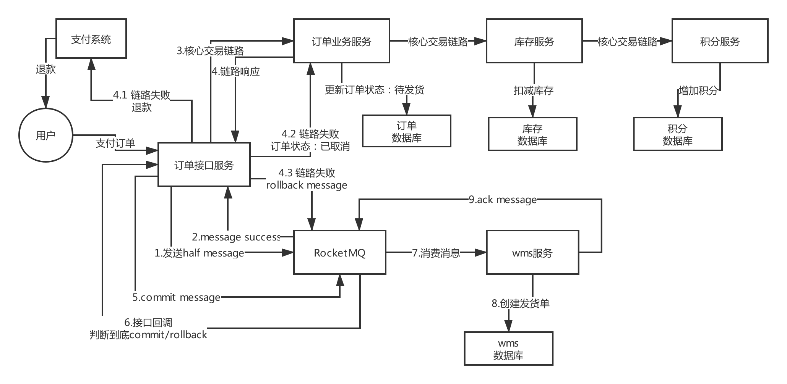

# RocketMQ

[RocketMQ入门总结](https://juejin.im/post/5df0825b51882512420af94a#heading-0)

## 分布式事务
可靠消息最终一致性方案

1) Producer向RocketMQ发送一个half message

RocketMQ返回一个`half message` success的响应给`Producer`，这个时候就形成了一个half message了，此时这个message是不能被消费的

注意，这个步骤可能会因为网络等原因失败，可能你没收到RocketMQ返回的响应，那么就需要重试发送half message，直到一个half message成功建立为止

2) 接着Producer本地执行数据库操作

Producer根据本地数据库操作的结果发送`commit/rollback`给RocketMQ，如果本地数据库执行成功，那么就发送一个commit给RocketMQ，让他把消息变为可以被消费的；如果本地数据库执行失败，那么就发送一个`rollback`给RocketMQ，废弃之前的message

注意，这个步骤可能失败，就是Producer可能因为网络原因没成功发送`commit/rollback`给RocketMQ，此时RocketMQ自己过一段时间发现一直没收到message的commit/rollback，就回调你服务提供的一个接口

此时在这个接口里，你需要自己去检查之前执行的本地数据库操作是否成功了，然后返回`commit/rollback`给RocketMQ

只要message被commit了，此时下游的服务就可以消费到这个消息，此时还需要结合ack机制，下游消费必须是消费成功了返回ack给RocketMQ，才可以认为是成功了，否则一旦失败没有ack，则必须让RocketMQ重新投递message给其他consumer