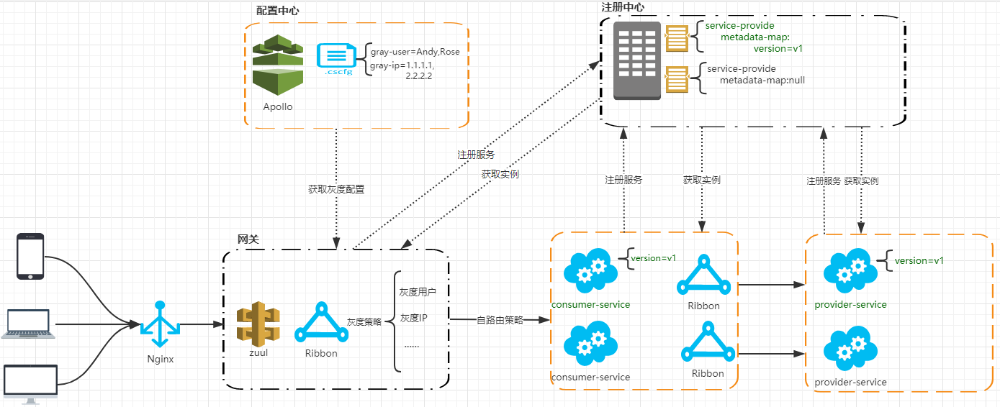

# 你们对网关的技术选型是怎么考虑的？能对比一下各种网关技术的优劣吗？

## 网关的核心功能

(1) 动态路由：新开发某个服务，动态把请求路径和服务的映射关系热加载到网关里去；服务增减机器，网关自动热感知

(2) 灰度发布

(3) 授权认证

(4) 性能监控：每个API接口的耗时、成功率、QPS

(5) 系统日志
    例如: 记录请求的参数和返回
    
(6) 数据缓存
    
(7) 限流熔断

## 几种技术选型

Kong、Zuul、Nginx+Lua（OpenResty）、自研网关

Kong：Nginx里面的一个基于lua写的模块，实现了网关的功能 Zuul：Spring Cloud来玩儿微服务技术架构，Zuul

Nginx+Lua（OpenResty）：课程目录里面，有一个文档，课程免费学习，亿级流量系统架构的课程，详细讲解了Nginx+Lua的开发，基于lua自己写类似Kong的网关 自研网关：自己来写类似Zuul的网关，基于Servlet、Netty来做网关，实现上述所有的功能

大厂：BAT、京东、美团、滴滴之类的，自研网关，都是基于Netty等技术自研网关；Nginx + Lua（Tengine）来做，封装网关的功能

中小型公司：Spring Cloud技术栈主要是用Zuul，Gateway；如果是Dubbo等技术栈，有的采用Kong等网关，也可以直接不用网关，很多公司压根儿就没用网关，直接Nginx反向代理+负载均衡；

Zuul：基于Java开发，核心网关功能都比较简单，但是比如灰度发布、限流、动态路由之类的，很多都要自己做二次开发

Kong：依托于Nginx实现，OpenResty，lua实现的模块，现成的一些插件，可以直接使用

Zuul（Servlet、Java）：高并发能力不强，部署到一些机器上去，还要基于Tomcat来部署，Spring Boot用Tomcat把网关系统跑起来；Java语言开发，可以直接把控源码，可以做二次开发封装各种需要的功能

优点: Nginx（Kong、Nginx+Lua）：Nginx抗高并发的能力很强，少数几台机器部署一下，就可以抗很高的并发

缺点: 精通Nginx源码，很难，c语言，很难说从Nginx内核层面去做一些二次开发和源码定制

Java技术栈为主的大厂，很多其实用Java、Servlet、Netty来开发高并发、高性能的网关系统，自己可以把控一切

## 灰度发布

[互联网产品的3种发布策略](http://www.appadhoc.com/blog/product-release-strategy/)

[SpringCloud灰度发布实践](https://segmentfault.com/a/1190000017412946?utm_source=tag-newest)