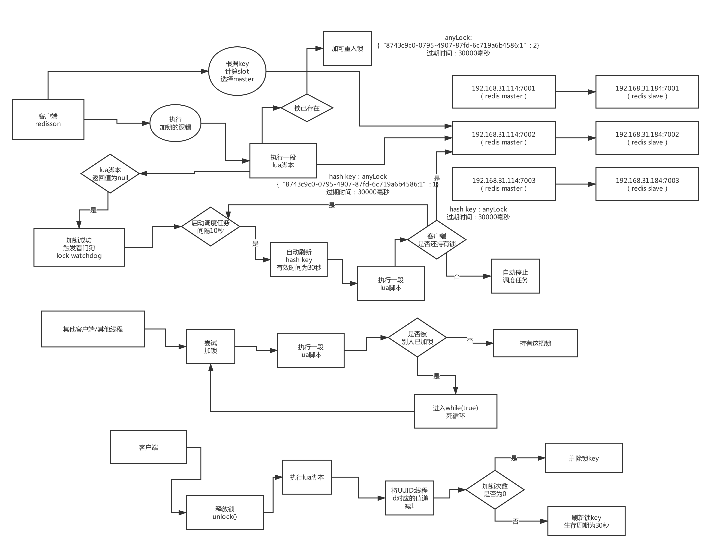

# 你们是用哪个开源框架实现的Redis分布式锁？能说说其核心原理么？
Redis分布式,很少自己撸,Redisson框架,他基于Redis实现了一系列的开箱即用的高级功能,比如说分布式锁

实现原理: 

 
比如说,苹果这个商品的id是1
redisson.lock("product_"+1+"_stock")

key的业务语义,就是针对product_id=1的商品的库存,也就是苹果的库存,进行加锁

1). 
执行加锁命令,`redisson`会发送一个lua脚本到redis,redis部署的集群(redis-cluster、master-slaver),根据key计算slot,选择master

写入的命令,1代表客户端已经加过锁
```
product_1_stock: { 
 "xxxx": 1 
}
```

2). watchdog 看门狗
`redisson`框架后台执行一段逻辑，每隔10s去检查一下这个锁是否还被当前客户端持有，如果是的话，重新刷新一下key的生存时间为30s
生存时间：30s

3). 其他客户端尝试加锁，这个时候发现"product_1_stock"这个key已经存在了，里面显示被别的客户端加锁了，此时他就会陷入一个无限循环，阻塞住自己，不能干任何事情，必须在这里等待

4). 第一个客户端加锁成功了,此时有两种情况,第一种情况，这个客户端操作完毕之后，主动释放锁；第二种情况，如果这个客户端宕机了，那么这个客户端的redisson框架之前启动的后台watchdog线程，就没了


5). 此时最多30s,key-value就消失了,自动释放了宕机客户端之前持有的锁