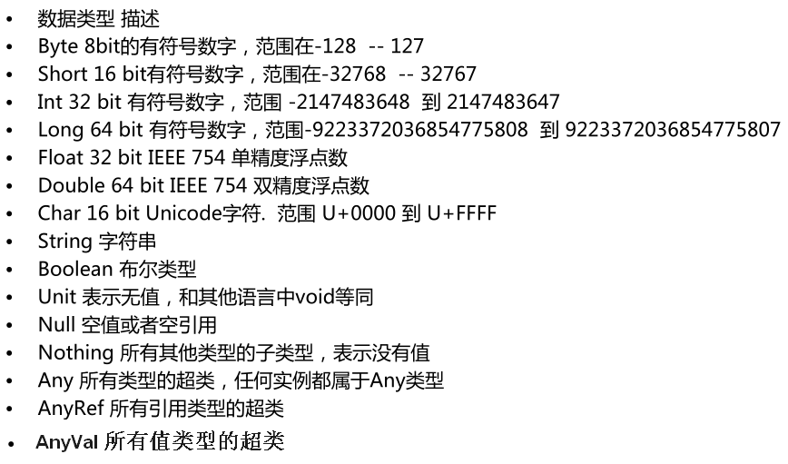
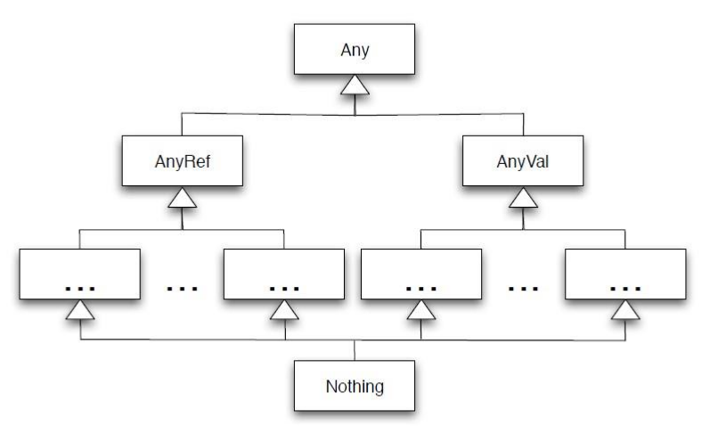
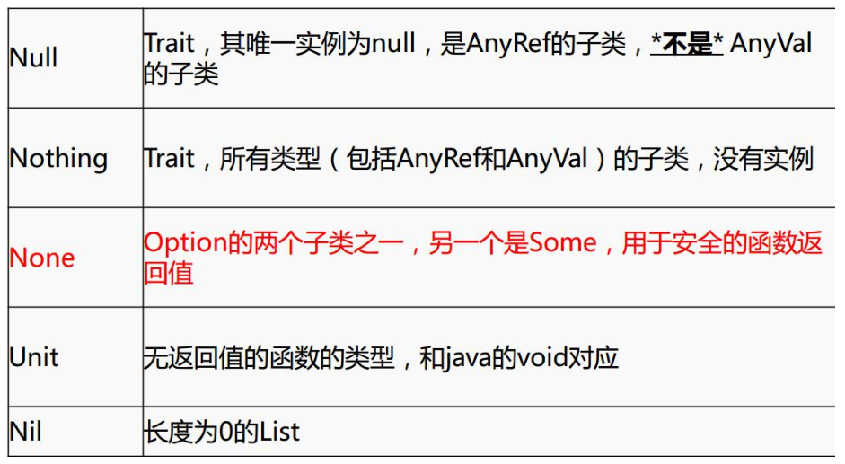

# Scala

## 大纲

### scala的概述
* 安装Scala
* 学习sdala的原因
* Scala语言诞生小故事
* Scala 和 Java 以及 jvm 的关
* Scala语言的特点
* Windows下搭建Scala开发环境
* Linux下搭建Scala开发环境
* Scala开发工具的介绍
* scala的开发的快速入门
* Scala语言转义字符
* Scala语言输出的三种方式

### Scala变量
* 变量是程序的基本组成单位
* 变量的介绍
* scala变量的基本使用
* Scala变量便用说明
* 整数类型
* 浮点类型
* 字符类型(Char)
* 布尔类型：Boolean
* Unit类型、Null类型和Nothing类型
* 值类型转换
* 数据类型转换的作业題

### Scala运算符
* 标识符的命名规范
* 运算符介绍
* 默运算符
* 关系运算符
* 比较运算符
* 逻辑运算符
* 赋值运算符
* 运算符优先级
* 键盘输入语句
* 案例实操


### 程序流程控制
* 程序的流程控制说明
* 顺序控制的说明
* 分支控制if~else
* 嵌套分支
* switch分支结构
* for循环控制
* while循环控制
* do..while循环控制
* 多重循环控制
* while循环的中断
* 课后练习题

###  Scala函数式编程的基础
* 函数式编程内容及授课顺序说明
* 函数式编程介绍
* 为什么需要函数
* 函数的定义
* 函数-调用机制
* 函数注意事项和细节讨论
* 函数练习题
* 过程
* 惰性函数
* 异常
* 函数的课堂练习题

### Scala面向对象编程(基础部分)
* 类与对象
* 方法
* 类与对象应用实例
* 构造器
* 属性高级
* 面向对象编程(中级部分）
* 包
* 包的可见性问题
* 包的引入
* 面向对象编程方法拍象
* 面向对象编程三大特征
* 面向对象编程-继承
* 面向对象编程作业

### Scala面向对象编程(高级特性)
* 静态属性和静态方法
* 单例对象
* 接口
* 特质(trait)
* 嵌套类//看源码，面试
* 隐式转换和隐式值
* 隐式转换
* 隐式转换丰富类库功能
* 隐式值
* 隐式类
* 隐式的转换时机
* 隐式解析机制
* 隐式转换俩个前提

### Scala数据结构（上）集合
* 数据结构特点
* 不可变集合继承层次一览图
* 可变集合继承层次一览图
* 数组一定长数组（声明泛型）
* 数组一变长数组（声明泛型）
* 数组一Scala数组与Java的List互转
* 元组Tuple－元组的基本使用
* 元组数据的访问
* 元组数据的遍历
* 列表 List
* ListBuffer
* 队列 Queue
* 映射 Map & 集 Set

### Scala数据结构（下）
* 集合元素的映射
* 集合元素的过滤
* 化简
* 折叠
* 扫描
* 集合综合应用案例
* 扩展一拉链（合并）
* 扩展一迭代器
* 扩展一流 Stream
* 扩展一视图 View
* 扩展一并行集合
* 扩展一操作符

### Scala模式匹配
* Match
* 守卫
* 模式中的变量
* 类型匹配
* 匹配数组
* 匹配列表
* 匹配元组
* 对象匹配
* 变量声明中的模式
* for 表达式中的模式
* 样例（模板）类
* case 语句的中置（缀）表达式
* 匹配嵌套结构 & 密封类

### Scala函数式编程高级
* 偏函数（ partialfunction )
* 作为参数的函数
* 匿名函数
* 高阶函数
* 参数（类型）推断
* 闭包（ closure )
* 函数柯里化（ curry )
* 控制抽象
* 使用递归的方式去思考，去编程
* 基本介绍
* 提倡函数式编程（递归思想）
* 应用实例
* 使用函数式编程方式宇符串翻转
* 使用递归一求阶乘
 
### 项目 Scala 客户信息管理系统
* 项目开发流程
* 项目需求分析
* 项目界面
* 项目设计-程序框架图
* 项目功能实现
* 并发编程模型 Akka
* Akka 介绍
* Actor 模型用于解决什么问题
* Akka 中 Actor 模型
* Actor 模型工作机制说明
* Actor 模型快速入门
* Actor 模型应用实例一Actor 间的通讯
* Akka 网络编程基本介绍
* Akka 网络编程一小黄鸡客服
     
### 学习设计模式的必要性
* 设计模式的介绍
* 设计模式类型
* 简单工厂
* 工厂方法模式
* 抽象工厂模式
* 工厂模式的小结
* 单例模式
* 装饰者模式（ Decorator )
* 观察者模式（ observer )
* 代理模式（Proxy）

### 泛型、上下界、视图界定、上下文界定
* 泛型的基本介绍
* 类型约束一上界/下界
* 类型约束一上下文界定
* 协变、逆变和不变
* Scala泛型应用案例
* 上界/下界应用案例
* 视图界定应用案例
* 上下文界定应用案例
* 逆变/协变应用案例
* Scala常见面试题及解答

## 1、doc

[挑逗 Java 程序员的那些 Scala 绝技](https://mp.weixin.qq.com/s/gTCGSa6UkxpdaeO2qzWovw)

## 2、简介
  [官网](https://www.scala-lang.org/)             

* 1). Java和scala可以混编(JVM的高层次语言)
* 2). 高阶函数
* 3). 模式匹配（类似java switch）
* 4). 特质，特征(类似java中interfaces 和 abstract结合)
* 5). 并发和分布式（Actor）
* 6). 类型推测(自动推测类型)
  
    

Scala combines object-oriented and functional programming in one concise, high-level language. 
Scala's static types help avoid bugs in complex applications, and its JVM and JavaScript runtimes let you build high-performance systems with easy access to huge ecosystems of libraries

Scala是一个面向对象和函数式编程的语言,是一个高级别的语言
Scala的静态类型能够帮助我们在复杂的应用程序避免掉许多bug,在jvm和javascript的运行环境中是高性能的系统,容易的访问生态系统中已有的jar包 


### 特征

* SEAMLESS JAVA INTEROP:Scala runs on the JVM, so Java and Scala stacks can be freely mixed for totally seamless integration

* TYPE INFERENCE:So the type system doesn’t feel so static. Don’t work for the type system. Let the type system work for you!

* CONCURRENCY & DISTRIBUTION:Use data-parallel operations on collections, use actors for concurrency and distribution, or futures for asynchronous programming

* TRAITS: Combine the flexibility of Java-style interfaces with the power of classes. Think principled multiple-inheritance

* PATTERN MATCHING:Think “switch” on steroids. Match against class hierarchies, sequences, and more.

* HIGHER-ORDER FUNCTIONS:Functions are first-class objects. Compose them with guaranteed type safety. Use them anywhere, pass them to anything.


## 3、学习Scala的意义
1) 钱
2) 做东西:Spark Kafka Flink(生态系统)
           优雅
           开发速度
           生态系统

##  4、Scala对比Java
### 定义变量和函数
```
// 变量
var x:Int=6
var x=6 // 类型推断
var y="scala"

// 函数
def square(x:Int):Int =x*x;
def square(x:Int)={x*x}
def annunce(text:String) {
    println(text);
}   
```

```scala
// 变量
int x=6;
final String y="scala";
int square(int x) {
    return x*x;
}

// 函数
void announce(String text) {
    Sysstem.out.println(text);
}

// 定义
def 方法名(参数名:参数类型):返回类型={
    // 括号内的叫做方法体
    
    // 方法体内的最后一行为返回值,不需要使用return
}
```

## 5、scala基础

### **1.** **数据类型**








### **2.** **变量和常量的声明**

* 定义变量或者常量的时候，也可以写上返回的类型，一般省略，如：val a:Int = 10

* 常量不可再赋值

  ```scala
      /**
       * 定义变量和常量
       * 变量 :用 var 定义 ，可修改 
       * 常量 :用 val 定义，不可修改
       */
      var name = "zhangsan"
      println(name)
      name ="lisi"
      println(name)
      val gender = "m"
  //    gender = "m"//错误，不能给常量再赋值
  ```

  

### **3.** **类和对象**

* 创建类

  ```scala
  class Person{
    val name = "zhangsan"
    val age = 18
    def sayName() = {
      "my name is "+ name
    }
  }
  ```

  * 创建对象

    ```scala
    object Lesson_Class {
        // 类是对象的抽象，而对象是类的具体实例。类是抽象的，不占用内存，而对象是具体的，占用存储空间。
        // 类是用于创建对象的蓝图，它是一个定义包括在特定类型的对象中的方法和变量的软件模板
       def main(args: Array[String]): Unit = {
        //  new 关键字来创建类的对象
        val person = new Person()
        println(person.age);
        println(person.sayName())
      }
    }
    ```

    * 对象中的apply方法

      object中不可以传参，当创建一个object时，如果传入参数，那么会自动寻找object中的相应参数个数的apply方法

      ```scala
      /**
        * object 单例对象中不可以传参，
        * 如果在创建Object时传入参数，那么会自动根据参数的个数去Object中寻找相应的apply方法
        */
      object Lesson_ObjectWithParam {
        def apply(s:String) = {
          println("name is "+s)
        }
        def apply(s:String,age:Int) = {
          println("name is "+s+",age = "+age)
        }
        def main(args: Array[String]): Unit = {
          Lesson_ObjectWithParam("zhangsang")
          Lesson_ObjectWithParam("lisi",18)
        }
      }
      ```

      * 伴生类和伴生对象

        ```scala
        class Person(xname :String , xage :Int){
          var name = Person.name
          val age = xage
          var gender = "m"
          def this(name:String,age:Int,g:String){
            this(name,age)
            gender = g
          }
          
          def sayName() = {
            "my name is "+ name
          }
        
        }
        
        object Person {
          val name = "zhangsanfeng"
          
          def main(args: Array[String]): Unit = {
            val person = new Person("wagnwu",10,"f")
            println(person.age);
            println(person.sayName())
            println(person.gender)
          }
        }
        ```

        注意点：

        * 建议类名首字母大写 ，方法首字母小写，类和方法命名建议符合驼峰命名法。

        * scala 中的object是单例对象，相当于java中的工具类，可以看成是定义静态的方法的类。object不可以传参数。另：Trait不可以传参数

        * scala中的class类默认可以传参数，默认的传参数就是默认的构造函数。

        重写构造函数的时候，必须要调用默认的构造函数。

        * class 类属性自带getter ，setter方法。

        * 使用object时，不用new,使用class时要new ,并且new的时候，class中除了方法不执行，其他都执行。

        * 如果在同一个文件中，object对象和class类的名称相同，则这个对象就是这个类的伴生对象，这个类就是这个对象的伴生类。可以互相访问私有变量。

### 循环

1  to 10
1.to(10)

## 6、隐式转换和隐式参数

### 隐式转换
```scala
package cn.itcast.impli

import java.io.File
import scala.io.Source


//隐式的增强File类的方法
class RichFile(val from: File) {
  def read = Source.fromFile(from.getPath).mkString
}

object RichFile {
  //隐式转换方法
  implicit def file2RichFile(from: File) = new RichFile(from)

}

object MainApp{
  def main(args: Array[String]): Unit = {
    //导入隐式转换
    import RichFile._
    //import RichFile.file2RichFile
    println(new File("c://words.txt").read)

  }
}
```