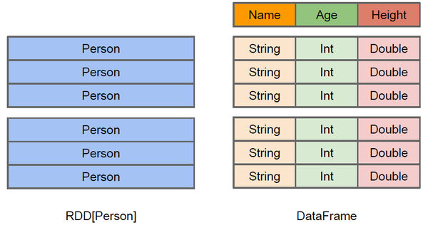
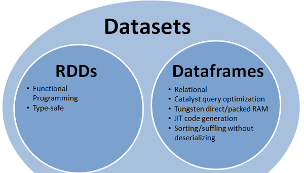
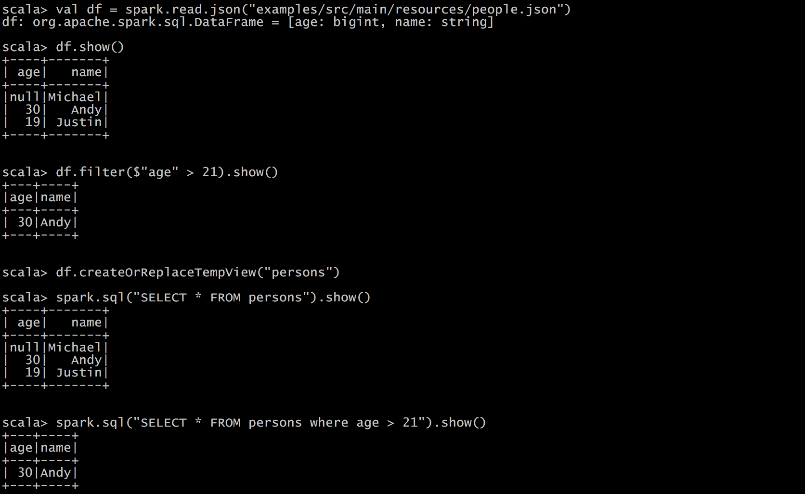
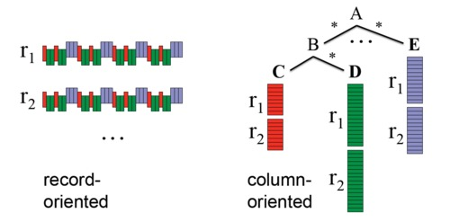

# Spark SQL and DataFrame

## 1.课程目标

* 掌握Spark SQL的原理

* 掌握DataFrame数据结构和使用方式

* 类型转换

* 熟练使用Spark SQL完成计算任务


## 2. Override

### doc

[奇虎360基于SparkSQL的海量数据仓库设计与实践](https://mp.weixin.qq.com/s/gCErgNcUiS4dBofkhvDLwQ)

[Spark SQL 之 Join 实现](https://mp.weixin.qq.com/s/ilPfDMUuOzLyd-v5xoMZ2Q)

[Spark SQL 内置函数列表](https://www.iteblog.com/archives/2336.html)

### 2.1.Spark SQL概述

#### 2.1.1. 什么是Spark SQL


Spark SQL是Spark用来处理结构化数据的一个模块，它提供了一个编程抽象叫做DataFrame并且作为分布式SQL查询引擎的作用。

将数据的计算任务通过SQL的形式转化为RDD的计算,类似于Hive通过SQl的形式将数据的计算任务转换成MapReduce

#### 2.1.2. 为什么要学习Spark SQL

我们已经学习了Hive，它是将Hive SQL转换成MapReduce然后提交到集群上执行，大大简化了编写MapReduce的程序的复杂性，由于MapReduce这种计算模型执行效率比较慢。所有Spark SQL的应运而生，它是将Spark SQL转换成RDD，然后提交到集群执行，执行效率非常快！


1.易整合


和Spark core的无缝整合,写RDD的应用时,配置Spark SQL实现逻辑


2.统一的数据访问方式


Spark 提供了标准化的SQL查询


3.兼容Hive


Hive的继承,Spark SQL通过内嵌Hive或者连接外部已经部署好的hive实例,实现对Hive语法的继承和操作


4.标准的数据连接


Spark SQL可以通过thrift Server来支持JDBC、ODBC的访问,将自己作为一个BI Server使用


#### 2.1.3 底层架构

首先拿到sql解析一批未解决的逻辑计划,再经过分析得到分析后的逻辑计划,再经过一批最佳优化的逻辑计划,再经过SparkPlanner的策略转化成一批物理计划,随后经过消费模型转换成一个个的Spark任务执行

### 2.2.DataFrames

#### 2.2.1.什么是DataFrames

Spark SQL的数据抽象

与RDD类似，DataFrame也是一个分布式数据容器。
然而DataFrame更像传统数据库的二维表格，除了数据以外，还记录数据的结构信息，即schema。
同时，与Hive类似，DataFrame也支持嵌套数据类型（struct、array和map）。
从API易用性的角度上 看，DataFrame API提供的是一套高层的关系操作，比函数式的RDD API要更加友好，门槛更低。
由于与R和Pandas的DataFrame类似，Spark DataFrame很好地继承了传统单机数据分析的开发体验。


            

#### 2.2.3 RDD vs DataFrames vs DataSet

     

版本的产生
Spark Core->RDD(Spark 1.0)
            DataFrame(Spark 1.3)
Spark SQL-> DataSet(Spark 1.6) 

在后期的Spark版本中，DataSet会逐步取代RDD和DataFrame成为唯一的API接口

##### RDD
* RDD是一个懒执行的不可变的可以支持Lambda表达式的并行数据集合。
* RDD的最大好处就是简单，API的人性化程度很高。
* RDD的劣势是性能限制，它是一个JVM驻内存对象，这也就决定了存在GC的限制和数据增加时Java序列化成本的升高

##### DataFrame

1). 性能比RDD要高(定制化内存管理、优化的执行计划);DataSet包含了DataFrame所有的优化机制

2). DataFrame和DataSet都有可控的内存管理机制,所有数据都保存在非堆上,使用了catalyst进行SQL优化

3). RDD+Schema,二维表格；编译期间不进行类型检查,运行期间检查

4). DataFrame = DataSet[Row] **底层封装的是RDD,只不过是Row类型**


##### Dataset

1) 是Dataframe API的一个扩展，是Spark最新的数据抽象;

2) 用户友好的API风格，具有**类型安全检查**和Dataframe的查询优化特性。

3) Dataset支持编解码器，当需要访问非堆上的数据时可以避免反序列化整个对象，提高了效率。

4) 样例类被用来在Dataset中定义数据的结构信息，样例类中每个属性的名称直接映射到DataSet中的字段名称。

5) Dataframe是Dataset的特列，DataFrame=Dataset[Row] ，所以可以通过as方法将Dataframe转换为Dataset。Row是一个类型，跟Car、Person这些的类型一样，所有的表结构信息我都用Row来表示。

6)DataSet是强类型的。比如可以有Dataset[Car]，Dataset[Person].

DataFrame只是知道字段，但是不知道字段的类型，所以在执行这些操作的时候是没办法在编译的时候检查是否类型失败的，比如你可以对一个String进行减法操作，在执行的时候才报错，而DataSet不仅仅知道字段，而且知道字段类型，所以有更严格的错误检查。就跟JSON对象和类对象之间的类比

##### 共性

1)、RDD、DataFrame、Dataset全都是spark平台下的分布式弹性数据集，为处理超大型数据提供便利
2)、三者都有惰性机制，在进行创建、转换，如map方法时，不会立即执行，只有在遇到Action如foreach时，三者才会开始遍历运算，极端情况下，如果代码里面有创建、转换，但是后面没有在Action中使用对应的结果，在执行时会被直接跳过.
```scala
val sparkconf = new SparkConf().setMaster("local").setAppName("test").set("spark.port.maxRetries","1000")
val spark = SparkSession.builder().config(sparkconf).getOrCreate()
val rdd=spark.sparkContext.parallelize(Seq(("a", 1), ("b", 1), ("a", 1)))
// map不运行
rdd.map{line=>
  println("运行")
  line._1
}
```
3)、三者都会根据spark的内存情况自动缓存运算，这样即使数据量很大，也不用担心会内存溢出
4)、三者都有partition的概念
5)、三者有许多共同的函数，如filter，排序等
6)、在对DataFrame和Dataset进行操作许多操作都需要这个包进行支持
```
import spark.implicits._
```
7)、DataFrame和Dataset均可使用模式匹配获取各个字段的值和类型
DataFrame:
```scala
testDF.map{
      case Row(col1:String,col2:Int)=>
        println(col1);println(col2)
        col1
      case _=>
        ""
    }
```
Dataset:
```scala
case class Coltest(col1:String,col2:Int)extends Serializable //定义字段名和类型
    testDS.map{
      case Coltest(col1:String,col2:Int)=>
        println(col1);println(col2)
        col1
      case _=>
        ""
    }
```

##### 三者的区别

RDD:

1)、RDD一般和spark mlib同时使用

2)、**RDD不支持sparksql操作**

DataFrame:

1)、与RDD和Dataset不同，DataFrame每一行的类型固定为Row，只有通过解析才能获取各个字段的值，如
```
testDF.foreach{
  line =>
    val col1=line.getAs[String]("col1")
    val col2=line.getAs[String]("col2")
}
```
**每一列的值没法直接访问**


2)、DataFrame与Dataset一般与spark ml同时使用

3)、**DataFrame与Dataset均支持sparksql的操作**，比如select，groupby之类，还能注册临时表/视窗，进行sql语句操作，如
```
dataDF.createOrReplaceTempView("tmp")
spark.sql("select  ROW,DATE from tmp where DATE is not null order by DATE").show(100,false)
```

4)、DataFrame与Dataset支持一些特别方便的保存方式，比如保存成csv，可以带上表头，这样每一列的字段名一目了然
```
//保存
val saveoptions = Map("header" -> "true", "delimiter" -> "\t", "path" -> "hdfs://master01:9000/test")
datawDF.write.format("com.atguigu.spark.csv").mode(SaveMode.Overwrite).options(saveoptions).save()
//读取
val options = Map("header" -> "true", "delimiter" -> "\t", "path" -> "hdfs://master01:9000/test")
val datarDF= spark.read.options(options).format("com.atguigu.spark.csv").load()
```
利用这样的保存方式，可以方便的获得字段名和列的对应，而且分隔符（delimiter）可以自由指定
5)、*劣势:编译期间缺少类型安全检查、运行期检查*

Dataset:

**Dataset和DataFrame拥有完全相同的成员函数，区别只是每一行的数据类型不同。**
**DataFrame也可以叫Dataset[Row],每一行的类型是Row，不解析，每一行究竟有哪些字段，各个字段又是什么类型都无从得知，只能用上面提到的getAS方法或者共性中的第七条提到的模式匹配拿出特定字段**
**而Dataset中，每一行是什么类型是不一定的，在自定义了case class之后可以很自由的获得每一行的信息**
```
case class Coltest(col1:String,col2:Int)extends Serializable //定义字段名和类型
/**
 rdd
 ("a", 1)
 ("b", 1)
 ("a", 1)
**/
val test: Dataset[Coltest]=rdd.map{line=>
      Coltest(line._1,line._2)
    }.toDS
test.map{
      line=>
        println(line.col1)
        println(line.col2)
    }
```
可以看出，Dataset在需要访问列中的某个字段时是非常方便的，然而，如果要写一些适配性很强的函数时，如果使用Dataset，行的类型又不确定，可能是各种case class，无法实现适配，这时候用DataFrame即Dataset[Row]就能比较好的解决问题

### 2.3.DataFrame常用操作

spark 客户端操作
```
var df = spark.read.json("examples/src/main/resources/people.json")

df.show()

df.filter($"age">21).show()

// createGlobalTempView:Register the DataFrame as a global temporary view，多个session可以使用
// createOrReplaceGlobalTempView
// createOrReplaceTempView:Register the DataFrame as a temporary view,注册成为一张表,当前session可用
// createTempView
df.createOrReplaceTempView("persons")

spark.sql("SELECT * FROM persons").show()

spark.sql("SELECT * FROM persons where age > 21").show()

// spark-shell来操作Spark SQL,spark作为SparkSession的变量名,sc作为SparkContext的变量名
// 通过Spark提供的方法读取json,将json文件转化为DataFrame
// 通过DataFrame提供的API来操作DataFrame里面的数据
// 将DataFrame注册为一个临时表的方式,来通过Spark.sql方式运行标准的SQL语句来查询
```



## 3.以编程方式执行Spark SQL查询
### 3.1.编写Spark SQL查询程序
前面我们学习了如何在Spark Shell中使用SQL完成查询，现在我们来实现在自定义的程序中编写Spark SQL查询程序。首先在maven项目的pom.xml中添加Spark SQL的依赖
```xml
<!--spark sql-->
<dependency>
    <groupId>org.apache.spark</groupId>
    <artifactId>spark-sql_2.10</artifactId>
    <version>1.5.2</version>
</dependency>
```
#### 3.1.1.通过反射推断Schema
创建一个object为cn.itcast.spark.sql.InferringSchema
```scala
package com.atguigu.sparksql

import org.apache.spark.sql.SparkSession
import org.apache.spark.{SparkConf, SparkContext}
import org.slf4j.LoggerFactory


/**
  * Created by wuyufei on 31/07/2017.
  */
object HelloWorld {

  val logger = LoggerFactory.getLogger(HelloWorld.getClass)

  def main(args: Array[String]) {
    //创建SparkConf()并设置App名称
    val spark = SparkSession
      .builder()
      .appName("Spark SQL basic example")
      .config("spark.some.config.option", "some-value")
      .getOrCreate()

    // For implicit conversions like converting RDDs to DataFrames
    // 隐式转换函数是以implicits关键字声明的带有单个参数的函数.这种函数将会自动转换应用,将值从一种类型转换为另一种类型
    //  导入隐式转换,将RDD转换成DataFrame
    import spark.implicits._

    val df = spark.read.json("examples/src/main/resources/people.json")

    // Displays the content of the DataFrame to stdout
    // show操作类似于Action,将DataFrame直接打印到Console
    df.show()
    
    // DSL风格的使用方式中,属性的获取方式
    df.filter($"age" > 21).show()
    
    // 将DataFrame注册为一张临时表
    df.createOrReplaceTempView("persons")

    // 通过Spark sql方式来运行sql
    spark.sql("SELECT * FROM persons where age > 21").show()

    spark.stop()
  }

}
```
将程序打成jar包，上传到spark集群，提交Spark任务
```scala
/home/hadoop/app/spark-2.2.0-bin-2.6.0-cdh5.7.0/bin/spark-submit \
--class cn.itcast.spark.sql.InferringSchema \
--master spark://hadoop:7077 \
/root/spark-mvn-1.0-SNAPSHOT.jar \
hdfs://hadoop:9000/person.txt \
hdfs://hadoop:9000/out 
```

#### 3.1.2.通过StructType直接指定Schema
创建一个object为cn.itcast.spark.sql.SpecifyingSchema
```scala
package cn.itcast.spark.sql

import org.apache.spark.sql.{Row, SQLContext}
import org.apache.spark.sql.types._
import org.apache.spark.{SparkContext, SparkConf}

/**
  * Created by ZX on 2015/12/11.
  */
object SpecifyingSchema {
  def main(args: Array[String]) {
    //创建SparkConf()并设置App名称
    val conf = new SparkConf().setAppName("SQL-2")
    //SQLContext要依赖SparkContext
    val sc = new SparkContext(conf)
    //创建SQLContext
    val sqlContext = new SQLContext(sc)
    //从指定的地址创建RDD
    val personRDD = sc.textFile(args(0)).map(_.split(" "))
    //通过StructType直接指定每个字段的schema
    val schema = StructType(
      List(
        StructField("id", IntegerType, true),
        StructField("name", StringType, true),
        StructField("age", IntegerType, true)
      )
    )
    //将RDD映射到rowRDD
    val rowRDD = personRDD.map(p => Row(p(0).toInt, p(1).trim, p(2).toInt))
    //将schema信息应用到rowRDD上
    val personDataFrame = sqlContext.createDataFrame(rowRDD, schema)
    //注册表
    personDataFrame.registerTempTable("t_person")
    //执行SQL
    val df = sqlContext.sql("select * from t_person order by age desc limit 4")
    //将结果以JSON的方式存储到指定位置
    df.write.json(args(1))
    //停止Spark Context
    sc.stop()
  }
}
```
将程序打成jar包，上传到spark集群，提交Spark任务
```scala
/home/hadoop/app/spark-2.2.0-bin-2.6.0-cdh5.7.0/bin/spark-submit \
--class cn.itcast.spark.sql.InferringSchema \
--master spark://hadoop.cn:7077 \
/root/spark-mvn-1.0-SNAPSHOT.jar \
hdfs://hadoop:9000/person.txt \
hdfs://hadoop.cn:9000/out1 
```

## 4.数据源
### 4.1.JDBC
Spark SQL可以通过JDBC从关系型数据库中读取数据的方式创建DataFrame，通过对DataFrame一系列的计算后，还可以将数据再写回关系型数据库中。

### 4.1.1.从MySQL中加载数据（Spark Shell方式）
#### 1.启动Spark Shell，必须指定mysql连接驱动jar包
启动spark
sbin/start-master.sh 
```scala
/usr/local/spark-1.5.2-bin-hadoop2.6/bin/spark-shell \
--master spark://node1.itcast.cn:7077 \
--jars /usr/local/spark-1.5.2-bin-hadoop2.6/mysql-connector-java-5.1.35-bin.jar \
--driver-class-path /usr/local/spark-1.5.2-bin-hadoop2.6/mysql-connector-java-5.1.35-bin.jar 
```
#### 2.从mysql中加载数据
```scala
val jdbcDF = sqlContext.read.format("jdbc").options(Map("url" -> "jdbc:mysql://192.168.10.1:3306/bigdata", "driver" -> "com.mysql.jdbc.Driver", "dbtable" -> "person", "user" -> "root", "password" -> "123456")).load()
```
##### 3.执行查询
jdbcDF.show()

### 4.1.2.将数据写入到MySQL中（打jar包方式）
#### 1.编写Spark SQL程序
```scala
package cn.itcast.spark.sql

import java.util.Properties
import org.apache.spark.sql.{SQLContext, Row}
import org.apache.spark.sql.types.{StringType, IntegerType, StructField, StructType}
import org.apache.spark.{SparkConf, SparkContext}

object JdbcRDD {
  def main(args: Array[String]) {
    val conf = new SparkConf().setAppName("MySQL-Demo")
    val sc = new SparkContext(conf)
    val sqlContext = new SQLContext(sc)
    //通过并行化创建RDD
    val personRDD = sc.parallelize(Array("1 tom 5", "2 jerry 3", "3 kitty 6")).map(_.split(" "))
    //通过StructType直接指定每个字段的schema
    val schema = StructType(
      List(
        StructField("id", IntegerType, true),
        StructField("name", StringType, true),
        StructField("age", IntegerType, true)
      )
    )
    //将RDD映射到rowRDD
    val rowRDD = personRDD.map(p => Row(p(0).toInt, p(1).trim, p(2).toInt))
    //将schema信息应用到rowRDD上
    val personDataFrame = sqlContext.createDataFrame(rowRDD, schema)
    //创建Properties存储数据库相关属性
    val prop = new Properties()
    prop.put("user", "root")
    prop.put("password", "123456")
    //将数据追加到数据库
    personDataFrame.write.mode("append").jdbc("jdbc:mysql://192.168.10.1:3306/bigdata", "bigdata.person", prop)
    //停止SparkContext
    sc.stop()
  }
}
```

#### 2.用maven将程序打包

#### 3.将Jar包提交到spark集群
```scala
/usr/local/spark-1.5.2-bin-hadoop2.6/bin/spark-submit \
--class cn.itcast.spark.sql.JdbcRDD \
--master spark://node1.itcast.cn:7077 \
--jars /usr/local/spark-1.5.2-bin-hadoop2.6/mysql-connector-java-5.1.35-bin.jar \
--driver-class-path /usr/local/spark-1.5.2-bin-hadoop2.6/mysql-connector-java-5.1.35-bin.jar \
/root/spark-mvn-1.0-SNAPSHOT.jar 
```

## 5.Spark应用解析

### 5.1.DataFrame的创建

#### 5.1.1.数据源的创建(通过Spark的数据源进行创建)
```scala
val df = spark.read.json("examples/src/main/resources/people.json")
// Displays the content of the DataFrame to stdout
df.show()
// +----+-------+
// | age|   name|
// +----+-------+
// |null|Michael|
// |  30|   Andy|
// |  19| Justin|
// +----+-------+
```

### 5.1.2.RDD的创建(从一个存在的RDD进行转换)
```scala
/**
Michael, 29
Andy, 30
Justin, 19
**/
scala> val peopleRdd = sc.textFile("examples/src/main/resources/people.txt")
peopleRdd: org.apache.spark.rdd.RDD[String] = examples/src/main/resources/people.txt MapPartitionsRDD[18] at textFile at <console>:24
//把每一行的数据用，隔开 然后通过第二个map转换成一个Array 再通过toDF 映射给name age
scala> val peopleDF3 = peopleRdd.map(_.split(",")).map(paras => (paras(0),paras(1).trim().toInt)).toDF("name","age")
peopleDF3: org.apache.spark.sql.DataFrame = [name: string, age: int]

scala> peopleDF.show()
+-------+---+
|   name|age|
+-------+---+
|Michael| 29|
|   Andy| 30|
| Justin| 19|
+-------+---+
```

#### 5.1.3.Hive的创建(从Hive Table进行查询返回)

### 5.2.DataFrame常用操作

#### 5.2.1.DSL风格语法

**前提:引入隐式转换import spark.implicits._**

```scala
// This import is needed to use the $-notation
import spark.implicits._
// Print the schema in a tree format
df.printSchema()
// root
// |-- age: long (nullable = true)
// |-- name: string (nullable = true)

// Select only the "name" column
df.select("name").show()
// +-------+
// |   name|
// +-------+
// |Michael|
// |   Andy|
// | Justin|
// +-------+

// Select everybody, but increment the age by 1
df.select($"name", $"age" + 1).show()
// +-------+---------+
// |   name|(age + 1)|
// +-------+---------+
// |Michael|     null|
// |   Andy|       31|
// | Justin|       20|
// +-------+---------+

// Select people older than 21
df.filter($"age" > 21).show()
// +---+----+
// |age|name|
// +---+----+
// | 30|Andy|
// +---+----+

// Count people by age
df.groupBy("age").count().show()
// +----+-----+
// | age|count|
// +----+-----+
// |  19|    1|
// |null|    1|
// |  30|    1|
// +----+-----+
```
#### 5.2.3.SQL风格语法

**前提:注册一张临时表**

```scala
// Register the DataFrame as a SQL temporary view
df.createOrReplaceTempView("people")

val sqlDF = spark.sql("SELECT * FROM people")
sqlDF.show()
// +----+-------+
// | age|   name|
// +----+-------+
// |null|Michael|
// |  30|   Andy|
// |  19| Justin|
// +----+-------+


// Register the DataFrame as a global temporary view
df.createGlobalTempView("people")

// Global temporary view is tied to a system preserved database `global_temp`
spark.sql("SELECT * FROM global_temp.people").show()
// +----+-------+
// | age|   name|
// +----+-------+
// |null|Michael|
// |  30|   Andy|
// |  19| Justin|
// +----+-------+

// Global temporary view is cross-session
spark.newSession().sql("SELECT * FROM global_temp.people").show()
// +----+-------+
// | age|   name|
// +----+-------+
// |null|Michael|
// |  30|   Andy|
// |  19| Justin|
// +----+-------+
```

临时表是Session范围内的，Session退出后，表就失效了。如果想应用范围内有效，可以使用全局表。注意使用全局表时需要加上前缀访问，如：global_temp.people

### 5.3.DataFrame、DataSet、RDD的互操作

var peopleRDD = sc.textFile("examples/src/main/resources/people.txt")

res2: Array[String] = Array(Michael, 29, Andy, 30, Justin, 19)

#### RDD->DataFrame
toDF("name","age")

var peopleDF=peopleRDD.map(_.split(",")).map(para=>(para(0).trim(),para(1).trim().toInt)).toDF("name","age")

```scala
scala>peopleDF.show
+-------+---+
|   name|age|
+-------+---+
|Michael| 29|
|   Andy| 30|
| Justin| 19|
+-------+---+
```

**一般用元组把一行的数据写在一起，然后在toDF中指定字段名**
```sc
import spark.implicits._
val testDF = rdd.map {line=>
      (line._1,line._2)
    }.toDF("col1","col2")
```

#### DataFrame/Dataset转RDD
dataFrame.rdd
dataSet.rdd

peopleDF.rdd.collect

res4: Array[org.apache.spark.sql.Row] = Array([Michael,29], [Andy,30], [Justin,19])

#### RDD转Dataset
toDS

**强类型,前提:定义样例类**
scala>case class Person(name:String,age:Int)

Person:样例类

**定义每一行的类型（case class）时，已经给出了字段名和类型，后面只要往case class里面添加值即可**


var peopleDS=Seq(Person("Lucy",25)).toDS

peopleDS.show


```scala
import spark.implicits._
case class Coltest(col1:String,col2:Int)extends Serializable //定义字段名和类型
val testDS = rdd.map {line=>
      Coltest(line._1,line._2)
    }.toDS
```

#### Dataset转DataFrame

**把case class封装成Row**

dataSet.toDF

```scala
scala>peopleDS.toDF.show
+----+---+
|name|age|
+----+---+
|Lucy| 25|
+----+---+
```

```
import spark.implicits._
val testDF = testDS.toDF
```

#### DataFrame转Dataset

dataFrame.as[Person]

```scala
scala> peopleDF.as[Person].collect
res11: Array[Person] = Array(Person(Michael,29), Person(Andy,30), Person(Justin,19))
```

```scala
import spark.implicits._
case class Coltest(col1:String,col2:Int)extends Serializable //定义字段名和类型
val testDS = testDF.as[Coltest]

//这种方法就是在给出每一列的类型后，使用as方法，转成Dataset，这在数据类型是DataFrame又需要针对各个字段处理时极为方便。
//在使用一些特殊的操作时，一定要加上 import spark.implicits._ 不然toDF、toDS无法使用
```
### 5.4.Dataset和RDD互操作
#### 5.4.1.通过反射获取Scheam

SparkSQL能够自动将包含有case类的RDD转换成DataFrame，case类定义了table的结构，case类属性通过反射变成了表的列名。

Case类可以包含诸如Seqs或者Array等复杂的结构。

```scala
map(attributes => Person(attributes(0), attributes(1).trim.toInt)).toDF()

// RDD->DataFrame
//peopleRDD.map(_.split(",")).map(para=>(para(0).trim(),para(1).trim().toInt)).toDF("name","age")

// 访问元素
teenagersDF.map(teenager => "Name: " + teenager(0)).show()
teenagersDF.map(teenager => "Name: " + teenager.getAs[String]("name")).show()
```

#### 5.4.2.通过编程设置Schema（StructType）

如果case类不能够提前定义，可以通过下面三个步骤定义一个DataFrame

1).创建一个多行结构的RDD

2).创建用StructType来表示的行结构信息

3).通过SparkSession提供的createDataFrame方法来应用Schema

```scala
// 1).创建一个多行结构的RDD
val peopleRDD = spark.sparkContext.textFile("examples/src/main/resources/people.txt")

val schemaString = "name age"
// Generate the schema based on the string of schema
val fields = schemaString.split(" ").map(fieldName => StructField(fieldName, StringType, nullable = true))

// 2).创建用StructType来表示的行结构信息
val schema = StructType(fields)

val rowRDD = peopleRDD.map(_.split(",")).map(attributes => Row(attributes(0), attributes(1).trim))

// 3).通过SparkSession提供的createDataFrame方法来应用Schema
val peopleDF = spark.createDataFrame(rowRDD, schema)
```

#### 5.5.用户自定义函数

通过spark.udf功能用户可以自定义函数

##### 5.5.1.用户自定义UDF函数
```scala
scala> val df = spark.read.json("examples/src/main/resources/people.json")
df: org.apache.spark.sql.DataFrame = [age: bigint, name: string]

scala> df.show()
+----+-------+
| age|   name|
+----+-------+
|null|Michael|
|  30|   Andy|
|  19| Justin|
+----+-------+


scala> spark.udf.register("addName", (x:String)=> "Name:"+x)
res5: org.apache.spark.sql.expressions.UserDefinedFunction = UserDefinedFunction(<function1>,StringType,Some(List(StringType)))

scala> df.createOrReplaceTempView("people")

scala> spark.sql("Select addName(name), age from people").show()
+-----------------+----+
|UDF:addName(name)| age|
+-----------------+----+
|     Name:Michael|null|
|        Name:Andy|  30|
|      Name:Justin|  19|
+-----------------+----+
```

##### 5.5.2.用户自定义聚合函数

5.5.2.1 弱类型用户自定义聚合函数

5.5.2.2 强类型用户自定义聚合函数

## 6.SparkSQL数据源 

### 6.1.通用加载/保存方法
默认数据源为Parquet格式.数据源为Parquet文件时，Spark SQL可以方便的执行所有的操作
修改默认的数据源格式:spark.sql.sources.default
```
val df = sqlContext.read.load("examples/src/main/resources/users.parquet") 
df.select("name", "favorite_color").write.save("namesAndFavColors.parquet")
```

当数据源格式不是parquet格式文件时,需要手动指定数据源的格式(json, parquet, jdbc, orc, libsvm, csv, text)

read.load:加载通用数据,使用write和save保存数据
```scala
val peopleDF = spark.read.format("json").load("examples/src/main/resources/people.json")
peopleDF.write.format("parquet").save("hdfs://hadoop000:8020/namesAndAges.parquet")

// 直接运行sql在文件上
val sqlDF = spark.sql("SELECT * FROM parquet.`hdfs://hadoop000:8020/users.parquet`")
sqlDF.show()

// 1).DataFrames读取json,保存为parquet,维护模式信息
// val peopleDF = spark.read.json("examples/src/main/resources/people.json").write.parquet("examples/src/main/resources/people.parquet")
// 2).启动hadoop   hadoop_home/sbin/start-all.sh
// 3).关闭安全模式 hadoop_home/
// put: Call From hadoop000/192.168.9.242 to hadoop000:8020 failed on connection exception: java.net.ConnectException: Connection refused; For more details see:  http://wiki.apache.org/hadoop/ConnectionRefused
// 4).上传文件到hdfs
// hadoop fs -put /home/hadoop/app/spark-2.2.0-bin-2.6.0-cdh5.7.0/examples/src/main/resources/people.parquet /
// 5).spark sql读取hdfs上的文件
// val parquetFileDF  = spark.read.parquet("hdfs://hadoop000:9000/people.parquet")
// 错误1:org.apache.spark.sql.AnalysisException: Call From hadoop000/192.168.9.242 to hadoop000:9000 failed on connection exception: java.net.ConnectException: Connection refused; For more details see:  http://wiki.apache.org/hadoop/ConnectionRefused; line 1 pos 14
// 原因:hdfs老版本的端口号为8020,新版本的端口为9000
// val parquetFileDF  = spark.read.parquet("hdfs://hadoop000:8020/people.parquet")
// 错误2:
// WARN ObjectStore: Failed to get database parquet, returning NoSuchObjectException
// sqlDF: org.apache.spark.sql.DataFrame = [name: string, favorite_color: string ... 1 more field]
// 创建视图(输出时,format("parquet)):parquetFileDF.createOrReplaceTempView("parquet")
// val namesDF = spark.sql("SELECT name FROM parquetFile WHERE age BETWEEN 13 AND 19")
// namesDF.map(attributes => "Name: " + attributes(0)).show()

```

文件保存选项
SaveMode执行存储操作(非原子操作,不会锁定)
| Scala/Java | Any Language | Meaning |
| ------ | ------ | ------ |
| SaveMode.ErrorIfExists(default) | "error"(default) | 如果文件存在，则报错 |
| SaveMode.Append | "append" | 追加 |
| SaveMode.Overwrite | ""overwrite"" | 覆写 |
| SaveMode.Ignore	 | "ignore" | 数据存在，则忽略 |

### 6.2.Parquet文件

Parquet是一种流行的列式存储格式，可以高效地存储具有嵌套字段的记录。



#### 6.2.1.Parquet读写
Parquet格式经常在Hadoop生态圈中被使用，它也支持Spark SQL的全部数据类型。Spark SQL 提供了直接读取和存储 Parquet 格式文件的方法
```scala
// Encoders for most common types are automatically provided by importing spark.implicits._
import spark.implicits._

val peopleDF = spark.read.json("examples/src/main/resources/people.json")

// DataFrames can be saved as Parquet files, maintaining the schema information
peopleDF.write.parquet("hdfs://master01:9000/people.parquet")

// Read in the parquet file created above
// Parquet files are self-describing so the schema is preserved
// The result of loading a Parquet file is also a DataFrame
val parquetFileDF = spark.read.parquet("hdfs://master01:9000/people.parquet")

// Parquet files can also be used to create a temporary view and then used in SQL statements
parquetFileDF.createOrReplaceTempView("parquetFile")
val namesDF = spark.sql("SELECT name FROM parquetFile WHERE age BETWEEN 13 AND 19")
namesDF.map(attributes => "Name: " + attributes(0)).show()
// +------------+
// |       value|
// +------------+
// |Name: Justin|
// +------------+
```

#### 6.2.2.解析分区信息

对表进行分区是对数据进行优化的方式之一。在分区的表内，数据通过分区列将数据存储在不同的目录下。Parquet数据源现在能够自动发现并解析分区信息,

自动解析分区类型 spark.sql.sources.partitionColumnTypeInference.enabled 默认为true,关闭为disabled;默认解析string类型

#### 6.2.3.Schema合并

用户可以先定义一个简单的Schema，然后逐渐的向Schema中增加列描述。通过这种方式，用户可以获取多个有不同Schema但相互兼容的Parquet文件。现在Parquet数据源能自动检测这种情况，并合并这些文件的schemas

因为Schema合并是一个高消耗的操作，在大多数情况下并不需要，所以Spark SQL从1.5.0开始默认关闭了该功能。可以通过下面两种方式开启该功能：

当数据源为Parquet文件时，将数据源选项mergeSchema设置为true

>sqlContext.read.option("mergeSchema", "true").parquet("hdfs://master01:9000/data/test_table")

设置全局SQL选项spark.sql.parquet.mergeSchema为true

### 6.3.Hive数据库

**Spark SQL中包含Hive的库，不需要安装Hive**

推荐编译Spark SQL时引入Hive支持

HiveQL 中的 CREATE TABLE(并非 CREATE EXTERNAL TABLE)语句来创建表，这些表会被放在默认的文件系统中的/user/hive/warehouse目录,

classPath中有配好的hdfs-site.xml,默认的文件系统就是 HDFS,否则本地文件系统

#### 6.3.1.内嵌Hive

用默认的hive,会在当前工作目录创建(Hive元数据仓库:metastore_db)


```scala
spark.sql("show tables").show
spark.sql("CREATE TABLE IF NOT EXISTS src(key INT,value STRING)")
spark.sql("show tables").show
spark.sql("SELECT * FROM src").show
spark.sql("LOAD DATA LOCAL INPATH 'examples/src/main/resources/kv1.txt' INTO TABLE src")
spark.sql("SELECT * FROM src").show
```

#### 6.3.2.外部Hive
复制 hive-site.xml 到spark_home/conf

>  bin/spark-shell --master spark://hadoop000:7077 --jars jars/mysql-connector-java-5.1.27-bin.jar

HiveContext

### 6.4.JSON数据集

### 6.5.JDBC
**相关的数据库驱动放到SPARK_HOME/lib**

>bin/spark-shell --jars jars/mysql-connector-java-5.1.27.jar


```scala
val jdbcDF = spark.read.format("jdbc").option("url", "jdbc:mysql://hadoop000:3306/mysql").option("dbtable", "db").option("user", "root").option("password", "root").load()

val connectionProperties = new Properties()
connectionProperties.put("user", "root")
connectionProperties.put("password", "root")
```

#### 8.项目实战 
慕课网日志实战

[基于SparkSql的日志分析实战](https://blog.csdn.net/sinat_37513998/article/details/82892444)

用户日志分析系统实战
(一) https://blog.csdn.net/qq_17776287/article/details/78535896
(二) https://blog.csdn.net/qq_17776287/article/details/78546161
(三) https://blog.csdn.net/qq_17776287/article/details/78557056
(四) https://blog.csdn.net/qq_17776287/article/details/78565958
(五) https://blog.csdn.net/qq_17776287/article/details/78566902
(六) https://blog.csdn.net/qq_17776287/article/details/78566904

数据处理流程
1）数据采集
	Flume： web日志写入到HDFS

2）数据清洗
	脏数据
	Spark、Hive、MapReduce 或者是其他的一些分布式计算框架  
	清洗完之后的数据可以存放在HDFS(Hive/Spark SQL)

3）数据处理
	按照我们的需要进行相应业务的统计和分析
	Spark、Hive、MapReduce 或者是其他的一些分布式计算框架

4）处理结果入库
	结果可以存放到RDBMS、NoSQL

5）数据的可视化
	通过图形化展示的方式展现出来：饼图、柱状图、地图、折线图
	ECharts、HUE、Zeppelin